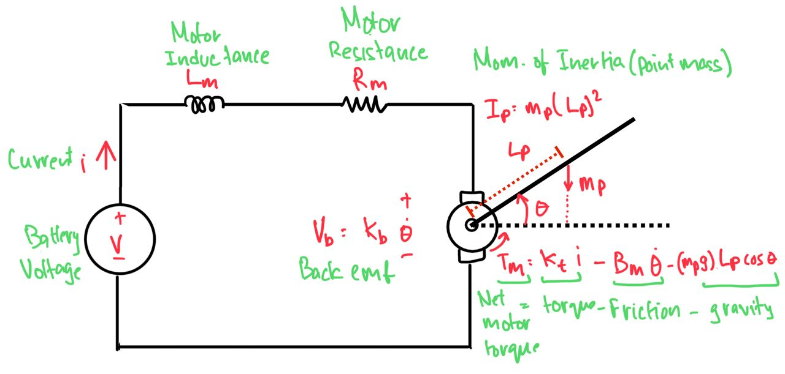

---
geometry:
  - margin=2cm
---

## Problem 2.a

For the given motor with a point mass attached, we are given:

- $R_m = 3.5 \Omega$ (motor resistance)
- $K_b = 0.1 Vs/rad$ (motor back EMF constant)
- $K_t = 0.5K_b = 0.05 Nm/A$ (motor torque constant)
- $L_m = 0 H$ (motor inductance)
- $m_p = 0.04 kg$ (point mass)
- $L_p = 0.1 m$ (distance from motor to point mass)
- $I_p = m_p(L_p)^2 = 0.0004 kgm^2$ (moment of inertia of point mass)
- $B_m = 0.000008 Nms/rad$ (motor viscous friction constant)
- $g = 9.81 m/s^2$ (acceleration due to gravity)

Let

- $\theta$ : angle of the motor shaft
- $V$ : input voltage
- $i$ : motor current
- $T_m$ : net torque on the motor shaft

We can derive the following equation for the voltage in the circuit

- Voltage drop due to inductance: $L_m\frac{di}{dt}$
- Voltage drop across the motor: $R_mi$
- Voltage drop due to back EMF: $K_b\dot{\theta}$

$$
\begin{aligned}
\implies V &= L_m\frac{di}{dt} + R_mi + K_b\dot{\theta} \\
\text{Since } L_m = 0, \text{ we have } V &= R_mi + K_b\dot{\theta} \\
i &= \frac{V - K_b\dot{\theta}}{R_m} \quad (1)
\end{aligned}
$$

We can also derive the following equation for the torque on the point mass

- Torque due to the motor: $K_ti$
- Frictional torque: $B_m\dot{\theta}$
- Force on mass due to gravity(weight): $m_pg$
- Perpendicular distance of the force of weight from the motor shaft: $L_p cos(\theta)$

$$
\begin{aligned}
\implies T_m &= K_ti - B_m\dot{\theta} - m_pgL_p cos(\theta) \\
\text{Substituting for } i \text{ from } (1),& \text{ we have} \\
T_m &= K_t\left(\frac{V - K_b\dot{\theta}}{R_m}\right) - B_m\dot{\theta} - m_pgL_p cos(\theta) \\
&= \frac{K_tV}{R_m} - \frac{K_tK_b\dot{\theta}}{R_m} - B_m\dot{\theta} - m_pgL_p cos(\theta) \\
&= \frac{K_tV}{R_m} - \left(\frac{K_tK_b}{R_m} + B_m\right)\dot{\theta} - m_pgL_p cos(\theta) \quad (2)
\end{aligned}
$$

Finally, using the equation of angular acceleration and torque, we have

$$
\begin{aligned}
T_m &= I_p\ddot{\theta} \\
\text{Substituting for } T_m \text{ from } (2),& \text{ we have} \\
I_p\ddot{\theta} &= \frac{K_tV}{R_m} - \left(\frac{K_tK_b}{R_m} + B_m\right)\dot{\theta} - m_pgL_p cos(\theta) \\
\ddot{\theta} &= \frac{K_tV}{I_pR_m} - \frac{1}{I_p}\left(\frac{K_tK_b}{R_m} + B_m\right)\dot{\theta} - \frac{m_pgL_p}{I_p} cos(\theta) \quad (3)
\end{aligned}
$$

For our state space model, we have the following state variables:

$$
x_1 = \theta \quad x_2 = \dot{\theta} \quad u = V
$$

Where we observe only the output angle $\theta$ of the motor shaft.
Which gives us the following state space equations:

$$
\begin{aligned}
\dot{x_1} &= x_2 \\
\dot{x_2} &= \frac{K_tu}{I_pR_m} - \frac{1}{I_p}\left(\frac{K_tK_b}{R_m} + B_m\right)x_2 - \frac{m_pgL_p}{I_p} cos(x_1) \\
y &= x_1
\end{aligned}
$$
