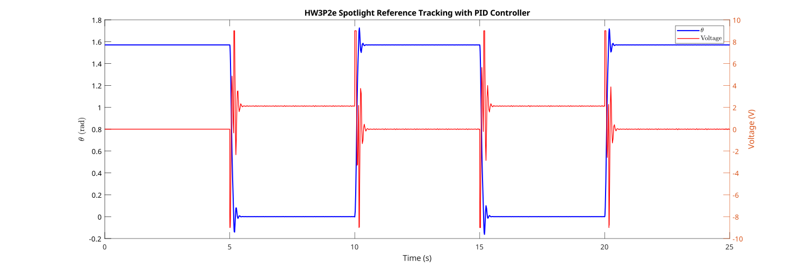

---
geometry:
  - margin=2cm
---

## Problem 2.a

For the given motor with a point mass attached, we are given:

- $R_m = 3.5 \Omega$ (motor resistance)
- $K_b = 0.1 Vs/rad$ (motor back EMF constant)
- $K_t = 0.5K_b = 0.05 Nm/A$ (motor torque constant)
- $L_m = 0 H$ (motor inductance)
- $m_p = 0.04 kg$ (point mass)
- $L_p = 0.1 m$ (distance from motor to point mass)
- $I_p = m_p(L_p)^2 = 0.0004 kgm^2$ (moment of inertia of point mass)
- $B_m = 0.000008 Nms/rad$ (motor viscous friction constant)
- $g = 9.81 m/s^2$ (acceleration due to gravity)

Let

- $\theta$ : angle of the motor shaft
- $V$ : input voltage
- $i$ : motor current
- $T_m$ : net torque on the motor shaft

We can derive the following equation for the voltage in the circuit

- Voltage drop due to inductance: $L_m\frac{di}{dt}$
- Voltage drop across the motor: $R_mi$
- Voltage drop due to back EMF: $K_b\dot{\theta}$

$$
\begin{aligned}
\implies V &= L_m\frac{di}{dt} + R_mi + K_b\dot{\theta} \\
\text{Since } L_m = 0, \text{ we have } V &= R_mi + K_b\dot{\theta} \\
i &= \frac{V - K_b\dot{\theta}}{R_m} \quad (1)
\end{aligned}
$$

We can also derive the following equation for the torque on the point mass

- Torque due to the motor: $K_ti$
- Frictional torque: $B_m\dot{\theta}$
- Force on mass due to gravity(weight): $m_pg$
- Perpendicular distance of the force of weight from the motor shaft: $L_p cos(\theta)$

$$
\begin{aligned}
\implies T_m &= K_ti - B_m\dot{\theta} - m_pgL_p cos(\theta) \\
\text{Substituting for } i \text{ from } (1),& \text{ we have} \\
T_m &= K_t\left(\frac{V - K_b\dot{\theta}}{R_m}\right) - B_m\dot{\theta} - m_pgL_p cos(\theta) \\
&= \frac{K_tV}{R_m} - \frac{K_tK_b\dot{\theta}}{R_m} - B_m\dot{\theta} - m_pgL_p cos(\theta) \\
&= \frac{K_tV}{R_m} - \left(\frac{K_tK_b}{R_m} + B_m\right)\dot{\theta} - m_pgL_p cos(\theta) \quad (2)
\end{aligned}
$$

Finally, using the equation of angular acceleration and torque, we have

$$
\begin{aligned}
T_m &= I_p\ddot{\theta} \\
\text{Substituting for } T_m \text{ from } (2),& \text{ we have} \\
I_p\ddot{\theta} &= \frac{K_tV}{R_m} - \left(\frac{K_tK_b}{R_m} + B_m\right)\dot{\theta} - m_pgL_p cos(\theta) \\
\ddot{\theta} &= \frac{K_tV}{I_pR_m} - \left(\frac{K_tK_b}{R_m} + B_m\right)\frac{\dot{\theta}}{I_p} - \frac{m_pgL_p}{I_p} cos(\theta) \quad (3)
\end{aligned}
$$

For our state space model, we have the following state variables:

$$
x_1 = \theta \quad x_2 = \dot{\theta} \quad u = V
$$

Where we observe only the output angle $\theta$ of the motor shaft.
Which gives us the following state space equations:

$$
\begin{aligned}
\dot{x_1} &= x_2 \\
\dot{x_2} &= \frac{K_tu}{I_pR_m} - \left(\frac{K_tK_b}{R_m} + B_m\right)\frac{x_2}{I_p} - \frac{m_pgL_p}{I_p} cos(x_1) \\
y &= x_1
\end{aligned}
$$

## Problem 2.b

To find the equilibrium points, we set $u=0$ and $\dot{x_1} = 0$:

$$
\begin{aligned}
0 &= x_2 \\
\implies x_2 &= 0 \\
\end{aligned}
$$

similarly, we set $\dot{x_2} = 0$:

$$
\begin{aligned}
0 &= \frac{K_tu}{I_pR_m} - \left(\frac{K_tK_b}{R_m} + B_m\right)\frac{x_2}{I_p} - \frac{m_pgL_p}{I_p} cos(x_1) \\
\text{Since } x_2 &= 0 \text{ and } u=0, \text{ we have} \\
0 &= \frac{K_t0}{I_pR_m} - \left(\frac{K_tK_b}{R_m} + B_m\right)\frac{0}{I_p} - \frac{m_pgL_p}{I_p} cos(x_1) \\
0 &= - \frac{m_pgL_p}{I_p} cos(x_1) \\
\implies cos(x_1) &= 0 \\
\end{aligned}
$$

Hence, the equilibrium points are

$$
\begin{aligned}
x_{1e} &= \pm\frac{\pi}{2} + 2\pi n \quad n \in \mathbb{Z} \\
x_{2e} &= 0 \\
u_{e} &= 0
\end{aligned}
$$

To comment on the stability of the points, we need to linearize the system around the equilibrium points and check the eigenvalues of the system. First, we need the Jacobian matrix $\nabla_x f$ where:

$$
\begin{aligned}
\boldsymbol{x} &= \begin{bmatrix} x_1 \\ x_2 \end{bmatrix} \\
f &= \begin{bmatrix} x_2 \\ \frac{K_tu}{I_pR_m} - \left(\frac{K_tK_b}{R_m} + B_m\right)\frac{x_2}{I_p} - \frac{m_pgL_p}{I_p} cos(x_1) \end{bmatrix} \\
\end{aligned}
$$

Then, the Jacobian matrix is:

$$
\begin{aligned}
\nabla_x f &= \begin{bmatrix} \frac{\partial f_1}{\partial x_1} & \frac{\partial f_1}{\partial x_2} \\ \frac{\partial f_2}{\partial x_1} & \frac{\partial f_2}{\partial x_2} \end{bmatrix} \\
\frac{\partial f_1}{\partial x_1} &= 0 \\
\frac{\partial f_1}{\partial x_2} &= 1 \\
\frac{\partial f_2}{\partial x_1} &= \frac{m_pgL_p}{I_p} sin(x_1) \\
\frac{\partial f_2}{\partial x_2} &= -\left(\frac{K_tK_b}{R_m} + B_m\right)\frac{1}{I_p} \\
\implies \nabla_x f &= \begin{bmatrix} 0 & 1 \\ \frac{m_pgL_p}{I_p} sin(x_1) & -\left(\frac{K_tK_b}{R_m} + B_m\right)\frac{1}{I_p} \end{bmatrix} \\
\end{aligned}
$$

Linearizing around the equilibrium points $x_{1e}, x_{2e}, u_{e}$, for $x_{1e}$ we select the points $\pi/2$ and $-\pi/2$.

For $x_{1e} = \pi/2$, we have:

$$
\begin{aligned}
A_1 &= \nabla_x f \Big|_{x_{1e} = \pi/2, x_{2e} = 0, u_{e} = 0} \\
&= \begin{bmatrix} 0 & 1 \\ \frac{m_pgL_p}{I_p} & -\left(\frac{K_tK_b}{R_m} + B_m\right)\frac{1}{I_p} \end{bmatrix} \\
\end{aligned}
$$

To check stability, we need to find the eigenvalues of the matrix $A_1$

- 7.84
- -12.51

Since we have an eigenvalue with a positive real part, the equilibrium point is unstable.

For $x_{1e} = -\pi/2$, we have:

$$
\begin{aligned}
A_2 &= \nabla_x f \Big|_{x_{1e} = -\pi/2, x_{2e} = 0, u_{e} = 0} \\
&= \begin{bmatrix} 0 & 1 \\ -\frac{m_pgL_p}{I_p} & -\left(\frac{K_tK_b}{R_m} + B_m\right)\frac{1}{I_p} \end{bmatrix} \\
\end{aligned}
$$

To check stability, we need to find the eigenvalues of the matrix $A_2$

- -2.33
- -2.33

Since we have eigenvalues with negative real parts, the equilibrium point is stable. In general, we can say that the equilibrium points

$$
\begin{aligned}
\boldsymbol{x}_{e} &= \begin{bmatrix} \pm\frac{\pi}{2} + 2\pi n \\ 0 \end{bmatrix} \quad n \in \mathbb{Z} \\
\end{aligned}
$$

are stable for $x_1 = -\frac{\pi}{2} + 2\pi n \quad n \in \mathbb{Z}$ (when the pendulum is hanging down) and unstable for $x_1 = \frac{\pi}{2} + 2\pi n \quad n \in \mathbb{Z}$ (when the pendulum is upright).

We can perturb the original system by adding a small disturbance to the system around the equilibrium points and observe the behavior of the system. In the case of closed circuit, the dynamics stay the same as derived above. However, for open circuit, no current can flow in the circuit, so $i=0$. Therefore, net torque on the motor shaft becomes

$$
\begin{aligned}
T_m &= K_t i - B_m \dot{\theta} - m_p g L_p cos(\theta) \\
&= K_t 0 - B_m \dot{\theta} - m_p g L_p cos(\theta) \\
&= - B_m \dot{\theta} - m_p g L_p cos(\theta) \quad (4)
\end{aligned}
$$

Using the eqution of angular acceleration and torque, we have

$$
\begin{aligned}
T_m &= I_p \ddot{\theta} \\
\text{Substituting for } T_m \text{ from } (4),& \text{ we have} \\
I_p \ddot{\theta} &= - B_m \dot{\theta} - m_p g L_p cos(\theta) \\
\ddot{\theta} &= - \frac{B_m}{I_p} \dot{\theta} - \frac{m_p g L_p}{I_p} cos(\theta) \quad (5)
\end{aligned}
$$

Using the state variables $x_1 = \theta, x_2 = \dot{\theta}$, we have the following state space equations for the open circuit case:

$$
\begin{aligned}
\dot{x_1} &= x_2 \\
\dot{x_2} &= - \frac{B_m}{I_p} x_2 - \frac{m_p g L_p}{I_p} cos(x_1) \\
y &= x_1
\end{aligned}
$$

The system state $\boldsymbol{x}$ were perturbed by a small amount $[-0.01, -0.01]^T$
Perturbed dynamics for $\boldsymbol{x}_{e1} = [\pi/2, 0]^T$ are:

.svg>){width=50%}
.svg>){width=50%}

We know that the equilibrium point $\boldsymbol{x}_{e1} = [\pi/2, 0]^T$ is unstable, so we see the perturbed
system diverging from this unstable equilibrium point in both cases and slowly stabilizing around the stable equilibrium point $\boldsymbol{x}_{e2} = [-\pi/2, 0]^T$.
However, the open circuit case does not stabilize within 10 seconds, while the closed circuit case does. This is because the closed circuit case has a damping torque due the back EMF of the motor ($K_t i$) and resistive power losses from the motor resistance ($R_m i$) in addition to the viscous friction torque which helps stabilize the system faster.

Perturbed dynamics for $\boldsymbol{x}_{e2} = [-\pi/2, 0]^T$ are:

.svg>){width=50%}
.svg>){width=50%}

We know that the equilibrium point $\boldsymbol{x}_{e2} = [-\pi/2, 0]^T$ is stable, so we see the perturbed
system converging to this stable equilibrium point in both cases. However, the open circuit case takes longer to stabilize compared to the closed circuit case. This is because the closed circuit case has a damping torque due the back EMF of the motor ($K_t i$) and resistive power losses from the motor resistance ($R_m i$) in addition to the viscous friction torque which helps stabilize the system faster. Even so, the open circuit system only wanders around the stable equilibrium point within the same order of magnitude as the perturbation and does not diverge.

## Problem 2.c

We already know the matrices $A_1$ and $A_2$ for the linearized system around the equilibrium points $\boldsymbol{x}_{e1}$ and $\boldsymbol{x}_{e2}$ respectively from part (b). We now need the matrices $B$, $C$ and $D$ for the state space representation of the system. To compute these, we will need the the jacobians $\nabla_u f$, $\nabla_x h$, and $\nabla_u h$ where:

$$
\begin{aligned}
\boldsymbol{x} &= \begin{bmatrix} x_1 \\ x_2 \end{bmatrix} \\
\boldsymbol{u} &= \begin{bmatrix} u \end{bmatrix} \\
\boldsymbol{y} &= \begin{bmatrix} y \end{bmatrix} \\
f &= \begin{bmatrix} x_2 \\ \frac{K_tu}{I_pR_m} - \left(\frac{K_tK_b}{R_m} + B_m\right)\frac{x_2}{I_p} - \frac{m_pgL_p}{I_p} cos(x_1) \end{bmatrix} \\
h &= \begin{bmatrix} x_1 \end{bmatrix} \\
\end{aligned}
$$

We can then define the jacobians as follows:

$$
\begin{aligned}
\nabla_u f &= \begin{bmatrix} \frac{\partial f_1}{\partial u} \\ \frac{\partial f_2}{\partial u} \end{bmatrix} \\
\frac{\partial f_1}{\partial u} &= 0 \\
\frac{\partial f_2}{\partial u} &= \frac{K_t}{I_pR_m} \\
\implies \nabla_u f &= \begin{bmatrix} 0 \\ \frac{K_t}{I_pR_m} \end{bmatrix} \\
\nabla_x h &= \begin{bmatrix} \frac{\partial h_1}{\partial x_1} & \frac{\partial h_1}{\partial x_2} \end{bmatrix} \\
\frac{\partial h_1}{\partial x_1} &= 1 \\
\frac{\partial h_1}{\partial x_2} &= 0 \\
\implies \nabla_x h &= \begin{bmatrix} 1 & 0 \end{bmatrix} \\
\nabla_u h &= \begin{bmatrix} \frac{\partial h_1}{\partial u} \end{bmatrix} \\
\frac{\partial h_1}{\partial u} &= 0 \\
\implies \nabla_u h &= \begin{bmatrix} 0 \end{bmatrix} \\
\end{aligned}
$$

Since none of them depend on $x_1$, they will be the same for both equilibrium points. Thus we have:

$$
\begin{aligned}
B &= \nabla_u f = \begin{bmatrix} 0 \\ \frac{K_t}{I_pR_m} \end{bmatrix} \\
C &= \nabla_x h = \begin{bmatrix} 1 & 0 \end{bmatrix} \\
D &= \nabla_u h = \begin{bmatrix} 0 \end{bmatrix} \\
\end{aligned}
$$

The transfer function of a system is $G(s) = C(sI - A)^{-1}B + D$.

At $\boldsymbol{x}_{e1} = [\pi/2, 0]^T$ we have:

$$
G_1(s) = C(sI - A_1)^{-1}B + D \\
$$

At $\boldsymbol{x}_{e2} = [-\pi/2, 0]^T$ we have:

$$
G_2(s) = C(sI - A_2)^{-1}B + D \\
$$

The inverse laplace transform of the transfer function gives the impulse response function of the system $g(t)$. Where $g(t) = \mathcal{L}^{-1}\{G(s)\}$.

At $\boldsymbol{x}_{e1} = [\pi/2, 0]^T$ we have:

$$
\begin{aligned}
g_1(t) &= \mathcal{L}^{-1}\{G_1(s)\} \\
&= 4.56 e^{-2.33t} sinh(10.2t) \\
\end{aligned}
$$

At $\boldsymbol{x}_{e2} = [-\pi/2, 0]^T$ we have:

$$
\begin{aligned}
g_2(t) &= \mathcal{L}^{-1}\{G_2(s)\} \\
&= 4.82 e^{-2.33t} sin(9.63t) \\
\end{aligned}
$$

We can plot the impulse response in matlab by using the `impulse` function in matlab.

.svg>){width=50%}
.svg>){width=50%}

For the stable equilibrium point $\boldsymbol{x}_{e2} = [-\pi/2, 0]^T$, the system converges to the equilibrium point with time as expected, similar to the perturbed dynamics. However, for the unstable equilibrium point $\boldsymbol{x}_{e1} = [\pi/2, 0]^T$, the system diverges from the equilibrium point. Since the transfer function here uses linearized dynamics, it is only accurate near the unstable equilibrium point. So once the system diverges, the linearized dynamics are no longer valid and the system diverges exponentially.

## Problem 2.d

To stabilize the system about $\theta=\pi/4$, we need to first linearize the dynamics around the point $\boldsymbol{x}_s = [\pi/4, 0]^T$. Using results from part (b) and (c), we have the matrices $A_s$, $B$, $C$, and $D$

$$
\begin{aligned}
A_s &= \begin{bmatrix} 0 & 1 \\ \frac{m_pgL_p}{I_p} sin(\pi/4) & -\left(\frac{K_tK_b}{R_m} + B_m\right)\frac{1}{I_p} \end{bmatrix} \\
B &= \begin{bmatrix} 0 \\ \frac{K_t}{I_pR_m} \end{bmatrix} \\
C &= \begin{bmatrix} 1 & 0 \end{bmatrix} \\
D &= \begin{bmatrix} 0 \end{bmatrix} \\
\end{aligned}
$$

Using these, we find the transfer function $G_s(s) = C(sI - A_s)^{-1}B + D$ symbolically using matlab to get

$$
\begin{aligned}
G_s(s) &= \frac{z}{as^2 + bs + c}
\text{ where } & \\
z &= 17867063951360000 \\
a &= 384829069721600 \\
b &= 1794402976530432 \\
c &= -26694505514669475
\end{aligned}
$$

We wish to design a feedback controller $C(s)$ such that the desired closed loop transfer function $G_{CL}(s)$ is of the following form

$$
\begin{aligned}
G_{CL}(s) &= \frac{\omega_n^2}{s^2 + 2\zeta\omega_n s + \omega_n^2} \\
\end{aligned}
$$

With the specifications

- Settling time: $t_s < 0.2s$
- Overshoot: $\%OS < 15\%$

We note that

$$
\begin{aligned}
t_s = \frac{4}{\zeta\omega_n} \\
\%OS &= e^{-\frac{\zeta\pi}{\sqrt{1-\zeta^2}}} \times 100 \% \\
\end{aligned}
$$

Therefore, the specifications give us the following constraints on $\zeta$ and $\omega_n$

$$
\begin{aligned}
t_s < 0.2s &\implies \zeta\omega_n > \frac{4}{0.2} \\
&\implies \zeta\omega_n > 20 \\
\%OS < 15\% &\implies e^{-\frac{\zeta\pi}{\sqrt{1-\zeta^2}}} < 0.15 \\
&\implies \zeta > \frac{-ln(0.15)}{\sqrt{\pi^2 + (ln(0.15))^2}} \\
&\implies \zeta > 0.5169 \\
&\implies \zeta = 0.5170 \\
\text{Therefore } \omega_n &> \frac{20}{0.517} \\
\implies \omega_n &> 38.6824 \\
\implies \omega_n &= 38.6825 \\
\end{aligned}
$$

Hence, we choose $\zeta = 0.5170$ and $\omega_n = 38.6825$ by by adding $0.0001$ to keep them as small as possible.

We wish to design a controller $C(s)$ such that the closed loop system satisfies the specifications and constraints with the desired poles:

$$
P_{1,2} = -\zeta\omega_n \pm i\omega_n\sqrt{1-\zeta^2}
$$

Using matlab, we find the desired poles, which are the roots of the denominator of the desired closed loop transfer function.

$$
\begin{aligned}
P_1 &= -20.00 + 33.11i \\
P_2 &= -20.00 - 33.11i \\
\end{aligned}
$$

Using the expression for $G_{CL}(s)$ for a PD controller, we have

$$
G_{CL}(s) = \frac{G_s(s)C(s)}{1 + G_s(s)C(s)} = \frac{\frac{z(K_P + K_Ds)}{a}}{s^2 + \left(\frac{z K_D + b}{a}\right)s + \frac{z K_P + c}{a}}
$$

We choose $K_P$ and $K_D$ such that the denominator of our $G_{CL}(s)$ mathces the denominator of the desired $G_{CL}(s)$, i.e.

$$
\begin{aligned}
s^2 + \left(\frac{z K_D + b}{a}\right)s + \frac{z K_P + c}{a} &= (s-P_1)(s-P_2) \\
s^2 + \left(\frac{z K_D + b}{a}\right)s + \frac{z K_P + c}{a} &= s^2 -(P_1 + P_2)s + P_1P_2 \\
\implies K_D = \frac{-a(P_1 + P_2) - b}{z} ,& \quad K_P = \frac{aP_1P_2 - c}{z} \\
\implies K_D = 0.76 ,& \quad K_P = 33.72 \\
\end{aligned}
$$

Since we actually want a PID controller to improve the steady state error, we need to add an additional pole
$P_I$ so that we can increase the order of the desired closed loop transfer function to 3. This way, we will have an additional term that we can use to derive the integral gain $K_I$. We choose $P_I$ such that it is sufficiently far from $P_1$ and $P_2$ to not affect the transient response. Typically, $P_I \ll -\zeta\omega_n$, at least $5\times$ away. However, if we place it too far away, the integral action will be too slow. After tuning the controller for good performance, I found that putting the pole $10\times$ away from $-\zeta\omega_n$ was a good compromise between speed and stability.

$$
\begin{aligned}
P_I &= -\zeta\omega_n \times 10 = -200
\end{aligned}
$$

Using this additional pole, we can update our PID gains in the following way:

$$
\begin{aligned}
\bar{K_P} &= K_P + \frac{a}{z}P_I(P_1 + P_2) &= 206.03 \\
\bar{K_I} &= -P_I P_1 P_2 \frac{a}{z} &= 6445.77 \\
\bar{K_D} &= K_D - \frac{a}{z}P_I &= 5.07 \\
\end{aligned}
$$

Resulting in the final controller

$$
\begin{aligned}
C(s) &= \bar{K_P} + \frac{\bar{K_I}}{s} + \bar{K_D}s
\end{aligned}
$$

## Problem 2.e

The contoller was implemented in simulink using the PID gains derived in part (d). The system was initialized at the linearization point.
The following blocks were added to a basic PID controller to ensure stability and performance:

- The reference had a maximum slew rate set to $\pm10$ rad/s to prevent the derivative term from causing large control inputs, which is realistic since the reference cannot change instantaneously.
- The integral term had a saturation block to prevent windup beyond $\pm100$, which is important since the system is unstable at $\theta = \pi/2$.
- A saturation block was added to limit the control input to $[9, -9]V$ to prevent the motor from being overdriven.

Which was able to follow the reference trajectory while staying within the bounds of $[9, -9]V$.

We can see that when the reference was set to $\pi/2$, the controller was able to maintain the stable equilibrium with only minor correction and resulted in only minor oscillations. This was difficult to achieve since even small offsets beyond $\pi/2$ can cause the system to diverge when using the linearized dynamics as seen in the impulse response in part (c).

When the reference was set to 0, the controller was again able to keep the system stable, counteracting gravity to maintain the reference position.

The only time we see the controller hit its output limits is when the reference changes from $\pi/2$ to 0 and vice versa, which is expected because those are the transitions that require the most control effort.

Given the design specifications of $t_s < 0.2s$ and $\%OS < 15\%$, we can see that the controller meets these specifications for most of the reference changes except for the initial change from $\theta = \pi/4$ to $\theta = \pi/2$. Here, it achieves a settling time of $350$ and an overshoot of $30\%$.

Hence, we can say that even though we used the linearized dynamics of the system at $\pi/4$ to design the controller, it was able to stabilize the system at $\pi/2$ and 0 as well while meeting the design specifications after initialization.
