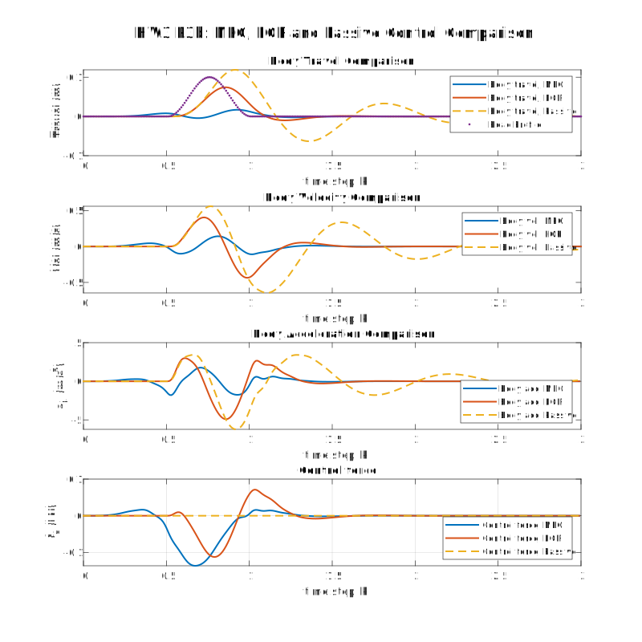

---
geometry:
  - margin=2cm
---

## Problem 3

In this problem, we have the dynamics of an active suspension system given [at this link](https://www.mathworks.com/help/robust/gs/active-suspension-control-design.html). The system parameters are

- States: $x = [x_b, \dot{x}_b, x_w, \dot{x}_w] \in \mathbb{R}^4$
- Inputs: $u = [F] \in \mathbb{R}$
- Reference profile: $d \in \mathbb{R}$
- Prediction horizon: $N = 50, 0.5s$
- Sampling time: $Ts = 0.01$ seconds
- Car's horizontal position: $s$

The system dynamics in continuous time are given by

$$
\begin{aligned}
\dot{x} &= A_c x + B_c [d \quad u]^T \\
A_c & \in \mathbb{R}^{4 \times 4} \\
B_c & \in \mathbb{R}^{4 \times 2}
\end{aligned}
$$

Note that the control input and disturbance profile are combined here, and their influence on the state is in the matrixc $B_c$. The matrices $A_c$, $B_c$ are given in the code. We can discretize the system using a zero order hold and a timestep of $Ts = 0.01$ seconds. The discretized system is given by

$$
\begin{aligned}
x_{k+1} &= A_d x_k + B [d_k \quad u_k]^T \\
A_d & \in \mathbb{R}^{4 \times 4} \\
B & \in \mathbb{R}^{4 \times 2}
\end{aligned}
$$

where $A_d$, $B$ are the discretized versions of $A_c$, $B_c$ respectively. The influence of the disturbance $d$ is contained in the first column of $B$, and the influence of the control input $u$ is in the second column. Hence, we split these out into separate matrices $B_d$, $E$ respectively. The dynamics of the system are now

$$
\begin{aligned}
x_{k+1} &= A_d x_k + B_d u_k + E d_k \\
A_d & \in \mathbb{R}^{4 \times 4} \\
B_d & \in \mathbb{R}^{4 \times 1} \\
E & \in \mathbb{R}^{4 \times 1}
\end{aligned}
$$

## Problem 3.a

The cost function that we want to minimize for MPC is a finite-horizon quadratic cost function given by

$$
J = \frac{1}{2} \sum_{k=j}^{j+N-1} (x_{k+1}^T Q x_{k+1} + \rho u_k^2)
$$

Subject to the dynamics without constraints. $Q$ and $\rho$ are the state and control penalties respectively, which are given in the code. The objective is to keep the body and wheel travel ($x_b$ and $x_w$) as close to zero as possible while minimizing the control effort. We are given the road profile preview for the prediction horizon $[d_k, \ldots, d_{k+N-1}]$ and we need to output the control sequence $[u_k, \ldots, u_{k+N-1}]$. To formulate this as a quadratic program, we need to stack the state and control variables into a single vector and construct matrices that relate them to each other. We start with the realization that

$$
\begin{aligned}
x_{k+1} &= A_d x_k + B_d u_k + E d_k \\
x_{k+2} &= A_d x_{k+1} + B_d u_{k+1} + E d_{k+1} \\
&= A_d (A_d x_k + B_d u_k + E d_k) + B_d u_{k+1} + E d_{k+1} \\
&= A_d^2 x_k + A_d B_d u_k + A_d E d_k + B_d u_{k+1} + E d_{k+1} \\
&\vdots \\
x_{k+N} &= A_d^N x_k + A_d^{N-1} B_d u_k + A_d^{N-2} B_d u_{k+1} + \ldots + A_d B_d u_{k+N-2} + B_d u_{k+N-1} + \ldots \\
&\quad + A_d^{N-1} E d_k + A_d^{N-2} E d_{k+1} + \ldots + E d_{k+N-1}
\end{aligned}
$$

Hence, we can construct the matrices

$$
\begin{aligned}
X_k = \begin{bmatrix} x_k \\ x_{k+1} \\ \vdots \\ x_{k+N-1} \end{bmatrix} &\in \mathbb{R}^{4N \times 4} &
U_k = \begin{bmatrix} u_k \\ u_{k+1} \\ \vdots \\ u_{k+N-1} \end{bmatrix} &\in \mathbb{R}^{N \times 1} &
\bar{d}_k = \begin{bmatrix} d_k \\ d_{k+1} \\ \vdots \\ d_{k+N-1} \end{bmatrix} &\in \mathbb{R}^{N \times 1} \\
\bar{\mathcal{A}} = \begin{bmatrix} A_d \\ A_d^2 \\ \vdots \\ A_d^N \end{bmatrix} &\in \mathbb{R}^{4N \times 4} &
\bar{\mathcal{B}} = \begin{bmatrix} B_d & 0 & \ldots & 0 \\ A_d B_d & B_d & \ldots & 0 \\ \vdots & \vdots & \ddots & \vdots \\ A_d^{N-1} B_d & A_d^{N-2} B_d & \ldots & B_d \end{bmatrix} &\in \mathbb{R}^{4N \times N} &
\bar{\mathcal{E}} = \begin{bmatrix} E & 0 & \ldots & 0 \\ A_d E & E & \ldots & 0 \\ \vdots & \vdots & \ddots & \vdots \\ A_d^{N-1} E & A_d^{N-2} E & \ldots & E \end{bmatrix} &\in \mathbb{R}^{4N \times N}
\end{aligned}
$$

Such that the sequence of states can be written as

$$
X_{k+1} = \bar{\mathcal{A}} x_k + \bar{\mathcal{B}} U_k + \bar{\mathcal{E}} \bar{d}_k
$$

Let the sequence without any control influence be denoted by $\mathcal{F}_k = \bar{\mathcal{A}} x_k + \bar{\mathcal{E}} \bar{d}_k$. Then

$$
\bar{X}_{k+1} = \mathcal{F}_k + \bar{\mathcal{B}} U_k
$$

Similarly, the cost matrices can be stacked into a diagonal matrices such that

$$
\begin{aligned}
\bar{Q} &= \text{diag}(Q, Q, \ldots, Q) \in \mathbb{R}^{4N \times 4N} \\
\bar{R} &= \text{diag}(\rho, \rho, \ldots, \rho) \in \mathbb{R}^{N \times N}
\end{aligned}
$$

Hence, the cost function becomes

$$
\begin{aligned}
J &= \frac{1}{2} (X_{k+1}^T \bar{Q} X_{k+1} + U_k^T \bar{R} U_k) \\
&= \frac{1}{2} ( (\mathcal{F}_k + \bar{\mathcal{B}} U_k)^T \bar{Q} (\mathcal{F}_k + \bar{\mathcal{B}} U_k) + U_k^T \bar{R} U_k ) \\
&= \frac{1}{2} ( (\mathcal{F}_k^T + U_k^T \bar{\mathcal{B}}^T) \bar{Q} (\mathcal{F}_k + \bar{\mathcal{B}} U_k) + U_k^T \bar{R} U_k ) \\
&= \frac{1}{2} ( \mathcal{F}_k^T \bar{Q} \mathcal{F}_k + U_k^T \bar{\mathcal{B}}^T \bar{Q} \mathcal{F}_k + \mathcal{F}_k^T \bar{Q} \bar{\mathcal{B}} U_k + U_k^T \bar{\mathcal{B}}^T \bar{Q} \bar{\mathcal{B}} U_k + U_k^T \bar{R} U_k ) \\
&= \frac{1}{2} ( \mathcal{F}_k^T \bar{Q} \mathcal{F}_k + 2 U_k^T \bar{\mathcal{B}}^T \bar{Q} \mathcal{F}_k + U_k^T (\bar{\mathcal{B}}^T \bar{Q} \bar{\mathcal{B}} + \bar{R}) U_k ) \text{ Since $\mathcal{F}_k^T \bar{Q} \bar{\mathcal{B}} U_k$ is a scalar}
\end{aligned}
$$

The solution to get the optimal control sequence $U_k^*$ under no constraints is given by setting the derivative $\partial J / \partial U_k = 0$. Hence, we have

$$
\begin{aligned}
\frac{\partial J}{\partial U_k} &= \bar{\mathcal{B}}^T \bar{Q} \bar{\mathcal{F}_k} + (\bar{\mathcal{B}}^T \bar{Q} \bar{\mathcal{B}} + \bar{R}) U_k = 0 \\
\implies U_k^* &= -(\bar{\mathcal{B}}^T \bar{Q} \bar{\mathcal{B}} + \bar{R})^{-1} \bar{\mathcal{B}}^T \bar{Q} \bar{\mathcal{F}_k}
\end{aligned}
$$

Then, at every time step, we pick the first element of the optimal control sequence $U_k^*$ as the control input $u_k$ to perform MPC as per the MPC control law.

In this formula, only the matrix $\bar{\mathcal{F}_k}$ depends on the current state $x_k$, hence we can pre-compute everything else to get the optimal control sequence efficiently

## Problem 3.b

The cost function that we want to minimize for LQR is an infinite-horizon quadratic cost function given by

$$
J = \frac{1}{2} \sum_{k=0}^{\infty} (x_{k+1}^T Q x_{k+1} + \rho u_k^2)
$$

subject to the system dynamics without any state or control constraints. For LQR, we dont have the disturbance preview, hence the system dynamics available in the optimization routine is just

$$
x_{k+1} = A_d x_k + B_d u_k
$$

We can solve the Discrete time Algebraic Riccati Equation (DARE) to get the optimal control law. The optimal control law is given by

$$
u_{k, opt} = -K_{opt} x_k
$$

where $K_{opt}$ is the optimal control gain matrix.

$$
K_{opt} = (\rho + B_d^T P B_d)^{-1} B_d^T P A_d
$$

And $P$ is the solution to the DARE

$$
-Q = A_d^T P A_d - P - A_d^T P B_d (\rho + B_d^T P B_d)^{-1} B_d^T P A_d
$$

We can get $K_{opt}$ directly by using MATLAB's `dlqr` function. This matrix does not depend on the current timestep $k$ and just needs to be computed once. The optimal control law is then used to compute the control input at every time step.

$\pagebreak$

## Problem 3.c

The plots in part (b) show that the active suspension maintains has a lower body travel, body velocity and body acceleration compared to the passive suspension. In addition, the active suspension has significantly more damped profile compared to the passive suspension.
This will result in a smoother ride for the passenger in the car and the car will regain stability much faster after a disturbance in the road.

When comparing between the active suspension systems, MPC and LQR, we can see that the MPC controller is able to return the body to the nominal position, acceleration and velocity much faster than the LQR controller while having a lot less body travel, velocity and acceleration. This is due to it having the disturbance preview which enables it to predict the disturbances and compensate for them in the control input. However, we can notice that MPC has a higher control effort compared to LQR.
