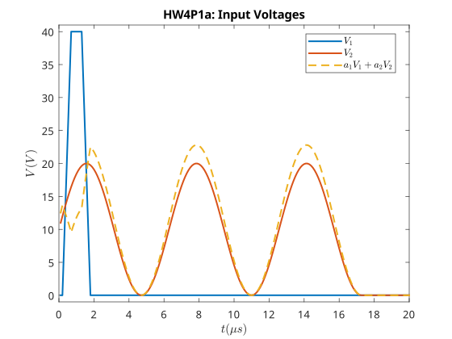
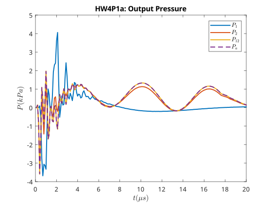

---
geometry:
  - margin=2cm
---

# ME599 Homework 4 - Akshat Dubey

## Problem 1

We have a system characterized by

- Input: $V(t)$ Voltage pulse imputed on the nozzle system
- System: $\mathcal{G}$, the nozzle system
- Output: $P(t)$ pressure wave at the nozzle

The system $\mathcal{G}$ is not available to us, it is a black box. We can only give it inputs and observe the outputs. In this problem we are trying to get the system to output a specific pressure waveform, and hence we need to implement a controller that can converge to a specific input voltage waveform that produces the desired pressure waveform.

### Problem 1.a

To check if the input-output operator $\mathcal{G}$ is linear, we can check if the system satisfies the superposition principle. This can be done by checking if the following equation holds true for all $V_1(t)$ and $V_2(t)$ and $a_1$ and $a_2$:

$$
\mathcal{G}(a_1 V_1(t) + a_2 V_2(t)) = a_1 \mathcal{G}(V_1(t)) + a_2 \mathcal{G}(V_2(t))
$$

For this, we first generate the two voltages $V_1(t)$ and $V_2(t)$ and set $a_1=-0.23$ and $a_2=1.14$ (chosen randomly).

Then we pass them through the operator $\mathcal{G}$ and plot the output pressure waveforms. Let

$$
\begin{aligned}
P_1(t) &= \mathcal{G}(V_1(t)) \\
P_2(t) &= \mathcal{G}(V_2(t)) \\
P_{12}(t) &= \mathcal{G}(a_1 V_1(t) + a_2 V_2(t)) \\
P_{a}(t) &= a_1 P_1(t) + a_2 P_2(t)
\end{aligned}
$$

In this plot, we can see that the pressure waveform for $P_{12}(t)$ (the output of the system for the combined input) is the same as the pressure waveform for $P_a(t)$ (the output of the system for the individual inputs scaled by $a_1$ and $a_2$). This means that the system satisfies the superposition principle and is hence $\mathcal{G}$ is linear.

## Problem 1.b

We have been given the deired pressure waveform $P_{ref}$ as a vector and we need to find the input voltage waveform vector $V^*$ that produces this pressure waveform. We can find this $V^*$ by constructing a cost function of the norm error $e$ between the desired pressure waveform and the output pressure waveform and choosing the $V_*$ that minimizes this cost function. The cost function can be defined as:

$$
\begin{aligned}
J &= \frac{1}{2} ||e||_2^2 \\
\text{where} &\\
e &= P_{ref} - \mathcal{G}(V) \\
\end{aligned}
$$

Since we know from part a that the system is linear, we can write the error as

$$
e = P_{ref} - GV
$$

Where G is a matrix that represents the linear system $\mathcal{G}$. To minimize the cost function, we can perform gradient descent on the cost function. The gradient of the cost function can be calculated as:

$$
\begin{aligned}
J&= \frac{1}{2} ||e||_2^2 \\
&= \frac{1}{2} e^T e \\
\implies \frac{\partial J}{\partial e} &= e \\
e &= P_{ref} - GV \\
\implies \frac{\partial e}{\partial V} &= -G^T \\
\text{therefore }\frac{\partial J}{\partial V} &= \frac{\partial e}{\partial V} \frac{\partial J}{\partial e} \\
&= -G^T e \\
\end{aligned}
$$

We can then use this gradient to perform gradient descent on the cost function. The update law for the gradient descent on the cost function $J$ for an iteration $i+1$ can be written as:

$$
\begin{aligned}
V_{i+1} &= V_i - \alpha \frac{\partial J}{\partial V} \\
&= V_i + \alpha G^T e \\
\end{aligned}
$$

Snce we do not know what G is, we cannot perform its transpose directly. We need to use a matrix $\tau$ to flip the the error vector, pass it through the system and then flip the result back. This effectively gives us the gradient of the cost function by transposing the matrix G.

$$
\begin{aligned}
\tau &= \begin{bmatrix}
0 & \dots & 0 & 1 \\
0 & 0 & 1 & 0 \\
\vdots & 1 & \vdots & \vdots \\
1 & 0 & \dots & 0
\end{bmatrix} \\
G^Te &= \tau \mathcal{G}(\tau e) \\
\end{aligned}
$$

Finally, we can write the optimization problem as

$$
\begin{aligned}
V^* &= \arg \min_{V} \frac{1}{2} ||e||_2^2 \\
\text{with the update law} &\\
V_{i+1} &= V_i + \alpha \tau \mathcal{G}(\tau e) \\
\text{where} &\\
e &= P_{ref} - \mathcal{G}(V) \\
\end{aligned}
$$

Setting the learning rate to 0.5, and the maximum number of iterations to be 10000, we get $V^*$ and a $\mathcal{G}(V^*)$. The resulting input-output waveforms are shown below

{ width=80% }

The error between the resulting pressure waveform and the desired pressure waveform is very small, which means that the optimization problem has converged to a good solution. The error is also shown below

{ width=80% }
