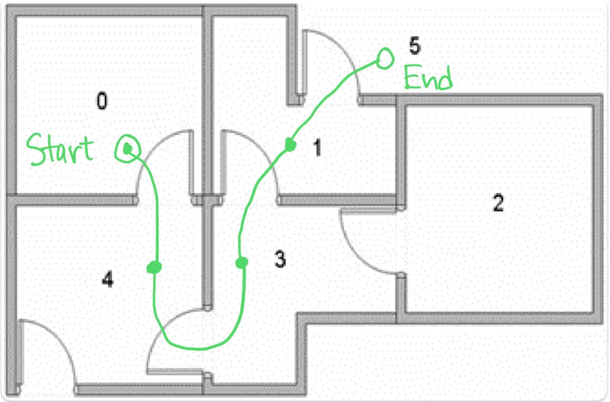
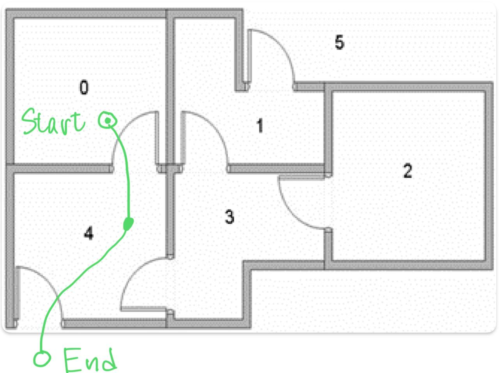

---
geometry:
  - margin=2cm
---

## Problem 3

For this reinforcement learning problem, we have an agent located in a building with 5 rooms connected by doors, with the 5th room being the outdoors. We want to find the optimal policy that the agent should follw to get outside the building from any room. There is no uncertainty in the environment, which means that the same action will always lead to the same outcome

### Problem 3.a

Here, we will use model-free Q-Learning where the state transition $p(x_{k+1}|x_k,u_k)$ is deterministic. This means that given an action $u_k$, the next state $x_{k+1} = u_k$. We have a total of 6 states $S = \{0, 1, 2, 3, 4, 5\}$ and the actions $u_k$ are the same as the states because the action just determines the next state directly in $S$.

The objective is to construct a Q-table that consists of the Q-values for each state-action pair, which is similar to the value function in dynamic programming. At the end of the algorithm, the Q-table will contain the Q-value for a state-action pair, which is defined as the expected reward when taking action $u_k$ in state $x_k$ and following the optimal policy thereafter.

$$
Q(x_k,u_k) = R(x_k,u_k) + \gamma \max_{u_{k+1}} Q(x_{k+1},u_{k+1})
$$

where $R(x_k,u_k)$ is the reward for taking action $u_k$ in state $x_k$, $\gamma$ is the discount factor, and $Q(x_{k+1},u_{k+1})$ is the Q-value for the next state-action pair.

$\gamma=0.8$ is given in the problem statement and the reward matrix $R$ is given as follows:

| State/Action | 0   | 1   | 2   | 3   | 4   | 5   |
| ------------ | --- | --- | --- | --- | --- | --- |
| 0            | -1  | -1  | -1  | -1  | 0   | -1  |
| 1            | -1  | -1  | -1  | 0   | -1  | 1   |
| 2            | -1  | -1  | -1  | 0   | -1  | -1  |
| 3            | -1  | 0   | 0   | -1  | 0   | -1  |
| 4            | 0   | -1  | -1  | 0   | -1  | 1   |
| 5            | -1  | 0   | -1  | -1  | 0   | 1   |

The $-1$ values in the table mean that it is impossible for the agent to move from one state to another, and thus such actions will be ignored.

We wish to explore the possible actions the agent can take in each state, and populate the Q-table with the Q-values for each state-action pair. Once we have the Q-table, we can use it to determine the optimal policy $\pi(x_k)$ for the agent such that it maximizes the reward of going outside to room 5. The optimal policy is basically just the action that has the maximum Q-value for each state.

We initialize the Q-learning algorithm as follows

- Initialize the Q-table with zeros
- Set the discount factor $\gamma = 0.8$
- Set max iterations $t_{max} = 2000$
- Pick a random initial state $x_0$ from the set of states $S = \{0, 1, 2, 3, 4, 5\}$

Then we will run the Q-learning algorithm as follows:

1. Select action and get reward
   - Select an action from $\{u_k \in S | u_k \neq -1\}$ with equal probability
   - Determine next state $x_{k+1}=u_k$
   - Get the reward $r_k = R(x_k,u_k)$
   - Increment iteration $t = t + 1$
2. Update Q-table

   - $$Q(x_k,u_k) = r_k + \gamma \max_{u_{k+1}} Q(x_{k+1},u_{k+1})$$

3. Check if iterations have been exceeded
   - If $t < t_{max}$, go to step 1
   - Else, stop the algorithm

Then, the optimal policy is given by

$$
\pi(x_k) = \arg\max_{u_k} Q(x_k,u_k)
$$

The optimal Q-table is as follows:

| State/Action | 0   | 1   | 2    | 3   | 4   | 5   |
| ------------ | --- | --- | ---- | --- | --- | --- |
| 0            | 0   | 0   | 0    | 0   | 4   | 0   |
| 1            | 0   | 0   | 0    | 3.2 | 0   | 5   |
| 2            | 0   | 0   | 0    | 3.2 | 0   | 0   |
| 3            | 0   | 4   | 2.56 | 0   | 4   | 0   |
| 4            | 3.2 | 0   | 0    | 3.2 | 0   | 5   |
| 5            | 0   | 4   | 0    | 0   | 4   | 5   |

The optimal policy is as follows:

| State | Action |
| ----- | ------ |
| 0     | 4      |
| 1     | 5      |
| 2     | 3      |
| 3     | 1/4    |
| 4     | 5      |
| 5     | 5      |

$\pagebreak$

### Problem 3.b

Now, we modify the reward matrix $R$ to change the reward for going from state 4 to 5 to be -0.9 instead of 1. The new Q-table is as follows:

| State/Action | 0     | 1   | 2    | 3   | 4    | 5   |
| ------------ | ----- | --- | ---- | --- | ---- | --- |
| 0            | 0     | 0   | 0    | 0   | 2.56 | 0   |
| 1            | 0     | 0   | 0    | 3.2 | 0    | 5   |
| 2            | 0     | 0   | 0    | 3.2 | 0    | 0   |
| 3            | 0     | 4   | 2.56 | 0   | 2.56 | 0   |
| 4            | 2.048 | 0   | 0    | 3.2 | 0    | 3.1 |
| 5            | 0     | 4   | 0    | 0   | 2.56 | 5   |

The optimal policy is as follows:

| State | Action |
| ----- | ------ |
| 0     | 4      |
| 1     | 5      |
| 2     | 3      |
| 3     | 1      |
| 4     | 3      |
| 5     | 5      |

{width=50%}

$\pagebreak$

We then modify the reward matrix $R$ again to change the reward for going from state 4 to 5 to be -0.5.
The new Q-table is as follows:

| State/Action | 0    | 1   | 2    | 3   | 4   | 5   |
| ------------ | ---- | --- | ---- | --- | --- | --- |
| 0            | 0    | 0   | 0    | 0   | 2.8 | 0   |
| 1            | 0    | 0   | 0    | 3.2 | 0   | 5   |
| 2            | 0    | 0   | 0    | 3.2 | 0   | 0   |
| 3            | 0    | 4   | 2.56 | 0   | 2.8 | 0   |
| 4            | 2.24 | 0   | 0    | 3.2 | 0   | 3.5 |
| 5            | 0    | 4   | 0    | 0   | 2.8 | 5   |

The optimal policy is as follows:

| State | Action |
| ----- | ------ |
| 0     | 4      |
| 1     | 5      |
| 2     | 3      |
| 3     | 1      |
| 4     | 5      |
| 5     | 5      |

{width=50%}

Yes, the optimal path changes if we change the reward for going from state 4 to 5 to -0.5.
