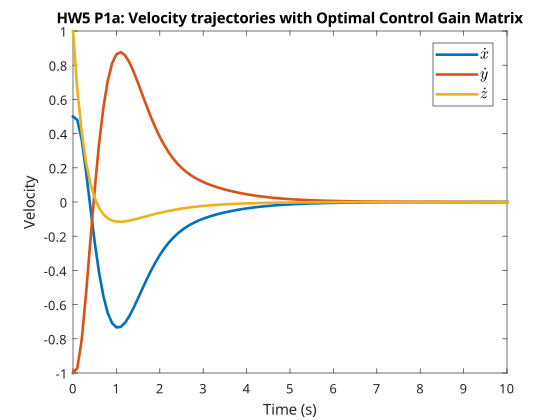

---
geometry:
  - margin=2cm
---

# ME599 Homework 5 - Akshat Dubey

## Problem 1

We have an aerial vehicle with the state $\boldsymbol{x}$ and control input $u$:

$$
\boldsymbol{x} = \begin{bmatrix}
x \\ y \\ z \\ \dot{x} \\ \dot{y} \\ \dot{z} \\ \phi \\ \theta \\ \psi \\ \dot{\phi} \\ \dot{\theta} \\ \dot{\psi}
\end{bmatrix} \in \mathbb{R}^{12}
,\quad
u = \begin{bmatrix}
u_1 \\ u_2 \\ u_3 \\ u_4
\end{bmatrix} \in \mathbb{R}^{4} \\
\quad n = 12, \quad m = 4
$$

The dynamics are given by the function $F =$ `aerialVehSim.p` in discrete time for a given time step $Ts$:

$$
\boldsymbol{x}_{k+1} = F(\boldsymbol{x}_k, u_k, Ts)
$$

### Problem 1.a

We want to design a discrete-time LQR controller for the system that drives the state to 0, with the cost function

$$
\begin{aligned}
J &= \sum_{k=0}^{\infty} \left( \boldsymbol{x}_k^T Q \boldsymbol{x}_k + u_k^T R u_k \right) \\
\text{where } \\
Q &= 10I_{12} \\
R &= I_{4} \\
\boldsymbol{x}_{x+1} &= F(\boldsymbol{x}_k, u_k, Ts) \\
Ts &= 0.1 \\
\boldsymbol{x}_0 &= \begin{bmatrix}
1 \\ -1 \\ 0 \\ 0.5 \\ -1 \\ 1 \\ 0 \\ 0 \\ 0 \\ 0 \\ 0 \\ 0 \\
\end{bmatrix}
\end{aligned}
$$

We note that the function $F$ is obscured, and is thus we dont know the matrices $A$ and $B$ for the system where

$$
\boldsymbol{x}_{k+1} = A \boldsymbol{x}_k + B u_k
$$

Hence, we shall use Reinforcement Learning based LQR for this problem.

First, we define the Value function $V$, which is the recursive optimal cost-to-go function under the optimal control policy $K_{opt}$ such that $u_k = -K_{opt} \boldsymbol{x}_k$:

$$
\begin{aligned}
V(\boldsymbol{x}_k) &= \boldsymbol{x}_k^T Q \boldsymbol{x}_k + u_k^T R u_k + V(\boldsymbol{x}_{k+1}) \\
&= \sum_{t=k}^{\infty} \left( \boldsymbol{x}_t^T Q \boldsymbol{x}_t + u_t^T R u_t \right) \text{(value from time $k$ to $\infty$)} \\
&= \sum_{t=k}^{\infty} \left( \boldsymbol{x}_t^T Q \boldsymbol{x}_t + (-K_{opt} \boldsymbol{x}_t)^T R (-K_{opt} \boldsymbol{x}_t) \right) \text{(substituting $u_t = -K_{opt} \boldsymbol{x}_t$)} \\
&= \sum_{t=k}^{\infty} \left( \boldsymbol{x}_t^T Q \boldsymbol{x}_t + \boldsymbol{x}_t^T K_{opt}^T R K_{opt} \boldsymbol{x}_t \right) \\
&= \sum_{t=k}^{\infty} \left( \boldsymbol{x}_t^T (Q + K_{opt}^T R K_{opt}) \boldsymbol{x}_t \right) \\
&= \sum_{t=k}^{\infty} \left( \boldsymbol{x}_t^T S \boldsymbol{x}_t \right) \text{(where $S = Q + K_{opt}^T R K_{opt}$)} \\
\end{aligned}
$$

We know that $\boldsymbol{x}_{k+1} = (A - B K_{opt}) \boldsymbol{x}_k$, so we can write the value function in terms of $P$, which is some combination of $A, B, S$ and $K_{opt}$,

$$
V(\boldsymbol{x}_k) = \boldsymbol{x}_k^T P \boldsymbol{x}_k
$$

Then, we construct the Q-function, which seeks to converge to the value function as we perform reinforcement learning. At timestep $k$, the Q-function is defined as the cost of being in the state $\boldsymbol{x}_k$ and taking action $u_k$, and then following the optimal policy $u_{k+1} = -K_{opt} \boldsymbol{x}_{k+1}$ from then onwards:

$$
\mathcal{Q}(\boldsymbol{x}_k, u_k) = \boldsymbol{x}_k^T Q \boldsymbol{x}_k + u_k^T R u_k + V(\boldsymbol{x}_{k+1}) \\
$$

Using the dynamics and the definition of the value function, we can rewrite the Q function as:

$$
\begin{aligned}
\mathcal{Q}(\boldsymbol{x}_k, u_k) &= \boldsymbol{x}_k^T Q \boldsymbol{x}_k + u_k^T R u_k + V(\boldsymbol{x}_{k+1}) \\
&= \boldsymbol{x}_k^T Q \boldsymbol{x}_k + u_k^T R u_k + \boldsymbol{x}_{k+1}^T P \boldsymbol{x}_{k+1} \\
&= \boldsymbol{x}_k^T Q \boldsymbol{x}_k + u_k^T R u_k + ( F(\boldsymbol{x}_k, u_k, Ts) )^T P ( F(\boldsymbol{x}_k, u_k, Ts) ) \\
&= \boldsymbol{x}_k^T Q \boldsymbol{x}_k + u_k^T R u_k + ( A \boldsymbol{x}_k + B u_k )^T P ( A \boldsymbol{x}_k + B u_k ) \\
&= \boldsymbol{x}_k^T Q \boldsymbol{x}_k + u_k^T R u_k + ( \boldsymbol{x}_k^T A^T P A \boldsymbol{x}_k + \boldsymbol{x}_k^T A^T P B u_k + u_k^T B^T P A \boldsymbol{x}_k + u_k^T B^T P B u_k ) \\
&= \boldsymbol{x}_k^T (Q+A^T P A) \boldsymbol{x}_k + u_k^T (R + B^T P B) u_k + \boldsymbol{x}_k^T A^T P B u_k + u_k^T B^T P A \boldsymbol{x}_k \\
\end{aligned}
$$

Defining

$$
\boldsymbol{z}_k = \begin{bmatrix}
\boldsymbol{x}_k \\ u_k
\end{bmatrix}
,\quad
\Theta = \begin{bmatrix}
Q + A^T P A & A^T P B \\
B^T P A & R + B^T P B
\end{bmatrix} \\
$$

Then,

$$
\mathcal{Q}(\boldsymbol{x}_k, u_k) = \boldsymbol{z}_k^T \Theta \boldsymbol{z}_k
$$

And the optimal policy can be obtained by minimizing over the converged Q function:

$$
\pi^*(\boldsymbol{x}_k) = \arg \min_{u_k} \mathcal{Q}(\boldsymbol{x}_k, u_k) \\
$$

Which can be found by setting the derivative of $\mathcal{Q}$ with respect to $u_k$ to zero:

$$
\begin{aligned}
\frac{\partial}{\partial u_k} \left( \boldsymbol{x}_k^T (Q+A^T P A) \boldsymbol{x}_k + u_k^T (R + B^T P B) u_k + \boldsymbol{x}_k^T A^T P B u_k + u_k^T B^T P A \boldsymbol{x}_k \right) &= 0 \\
\frac{\partial}{\partial u_k} \left( u_k^T (R + B^T P B) u_k + \boldsymbol{x}_k^T A^T P B u_k + u_k^T B^T P A \boldsymbol{x}_k \right) &= 0 \\
\frac{\partial}{\partial u_k} \left( u_k^T (R + B^T P B) u_k + 2 u_k^T B^T P A \boldsymbol{x}_k \right) &= 0 \\
2 (R + B^T P B) u_k + 2 B^T P A \boldsymbol{x}_k &= 0 \\
u_k &= - (R + B^T P B)^{-1} (B^T P A \boldsymbol{x}_k) \\
\end{aligned}
$$

Which gives us the optimal policy:

$$
\begin{aligned}
\pi^*(\boldsymbol{x}_k) &= - (R + B^T P B)^{-1} (B^T P A \boldsymbol{x}_k) \\
\implies u_k^* &= -K_{opt} \boldsymbol{x}_k \\
\text{ where } K_{opt} &= (R + B^T P B)^{-1} (B^T P A) \\
\end{aligned}
$$

Note that $K_{opt}$ is a function of the last row of $\Theta$, so as long as we can converge to an estimate $\Theta$ we can find $K_{opt}$. We don't need to find the individual matrices $A$ and $B$!

$$
\Theta = \begin{bmatrix}
\Theta_{xx} & \Theta_{xu} \\
\Theta_{ux} & \Theta_{uu}
\end{bmatrix}, \text{then, } K_{opt} = \Theta_{uu}^{-1} \Theta_{ux}
$$

Initially, $P$ will contain some $K \neq K_{opt}$, but after many iterations, once the Q function has converged, the Q function with the optimal policy $u_k = -K_{opt} \boldsymbol{x}_k$ should also converge to the function $V$

$$
\begin{aligned}
\mathcal{Q}(\boldsymbol{x}_k, -K_{opt} \boldsymbol{x}_k) &= V(\boldsymbol{x}_k) \\
\text{Using the definition of the Q function after convergence,} \\
\mathcal{Q}(\boldsymbol{x}_k, u_k) &= \boldsymbol{x}_k^T Q \boldsymbol{x}_k + u_k^T R u_k + V(\boldsymbol{x}_{k+1}) \\
&= \boldsymbol{x}_k^T Q \boldsymbol{x}_k + u_k^T R u_k + \mathcal{Q}(\boldsymbol{x}_{k+1}, -K_{opt} \boldsymbol{x}_{k+1}) \\
\text{Let } \boldsymbol{z}^* &= \begin{bmatrix} \boldsymbol{x}_k \\ u_k^* \end{bmatrix}
= \begin{bmatrix} \boldsymbol{x}_k \\ -K_{opt} \boldsymbol{x}_k \end{bmatrix} \text{ then,} \\
&= \boldsymbol{z}_k^T \begin{bmatrix} Q & 0 \\ 0 & R \end{bmatrix} \boldsymbol{z}_k + \boldsymbol{z}_{k+1}^{*T} \Theta \boldsymbol{z}_{k+1}^* \\
\text{ defining } \bar{Q} &= \begin{bmatrix} Q & 0 \\ 0 & R \end{bmatrix} \\
&= \boldsymbol{z}_k^T \bar{Q} \boldsymbol{z}_k + \boldsymbol{z}_{k+1}^{*T} \Theta \boldsymbol{z}_{k+1}^*
\end{aligned}
$$

Hence

$$
\mathcal{Q}(\boldsymbol{x}_k, u_k) = \boldsymbol{z}_k^T \Theta \boldsymbol{z}_k = \boldsymbol{z}_k^T \bar{Q} \boldsymbol{z}_k + \boldsymbol{z}_{k+1}^{*T} \Theta \boldsymbol{z}_{k+1}^*
$$

Now, we just need to find a way to iteratively update $\Theta$ and $K$ so that the Q function converges to the value function and $K$ converges to $K_{opt}$. We can do this by using an off-policy algorithm.
First, we will need to generate some data using a sequence of control inputs $\{u_k\}_{k=0}^{N-1} = \{u_0 \dots u_{N-1}\}$ where $N \geq (m+1)L - 1$. We generate this by starting at $x_0$, sequentially applying random control inputs and capture the next state. This sequence is said to be persistently exciting of order $L$ if the Hankel matrix $H_L(\{u_k\}_{k=0}^{N-1})$ is has full row rank $mL$. Then Hankel matrix is defined as:

$$
H_L(\{u_k\}_{k=0}^{N-1}) = \begin{bmatrix}
u_0 & u_1 & \dots & u_{N-L} \\
u_1 & u_2 & \dots & u_{N-L+1} \\
\vdots & \vdots & \ddots & \vdots \\
u_{L-1} & u_L & \dots & u_{N-1}
\end{bmatrix} \in \mathbb{R}^{mL \times (N - L + 1)}
$$

We need a sequence of order $n+1$, which means

$$
\begin{aligned}
L &= n + 1 = 12 + 1 = 13 \\
N &\geq (m+1)L -1  \\
N &\geq (m+1)(n+1) - 1 \\
N &\geq m(n+1) + n \\
N &\geq 4(12+1) + 12 \\
\implies N &\geq 64 \\
\implies mL &= 4 \cdot 13 = 52
\end{aligned}
$$

From the $N$ total samples, we select $l=n+m=16$ samples of $\boldsymbol{x}_{k_j}, u_{k_j}, \boldsymbol{x}_{k_j+1}$ such that the control input and state pairs $\boldsymbol{z}_{k_j} = \begin{bmatrix} \boldsymbol{x}_{k_j} \\ u_{k_j} \end{bmatrix}$ ,where $j\in \{1 \dots l\}$ are linearly independent.

Then:

1. Initialize $i=0$, $K_i=0$
2. Initialize $\boldsymbol{z}_{i,k_j+1}^* = \begin{bmatrix} \boldsymbol{x}_{k_j+1} \\ -K_i \boldsymbol{x}_{k_j+1} \end{bmatrix}$ for $j=1 \dots l$.
3. Using all $l$ samples, define the set of $l$ equations
   - $\boldsymbol{z}_{k_j}^T \Theta_{i+i} \boldsymbol{z}_{k_j} = \boldsymbol{z}_{k_j}^T\bar{Q} \boldsymbol{z}_{k_j} + \boldsymbol{z}_{i,k_j+1}^{*T} \Theta_{i+1} \boldsymbol{z}_{i,k_j+1}^*$
   - Stack $\boldsymbol{z}_{k_j}$ and $\boldsymbol{z}_{i,k_j+1}^*$ columnwise into $Z$ and $Z^*$ where
     - $Z = \begin{bmatrix} \boldsymbol{z}_{k_1} & \boldsymbol{z}_{k_2} & \dots & \boldsymbol{z}_{k_l} \end{bmatrix}$
     - $Z^* = \begin{bmatrix} \boldsymbol{z}_{k_1+1}^* & \boldsymbol{z}_{k_2+1}^* & \dots & \boldsymbol{z}_{k_l+1}^* \end{bmatrix}$
   - Form the equation $Z^T \Theta_{i+1} Z = Z^T \bar{Q} Z + Z^{*T} \Theta_{i+1} Z^* \\ \implies Z^{*T} \Theta_{i+1} Z^* - Z^T \Theta_{i+1} Z + Z^T \bar{Q} Z  = 0$
4. Using MATLAB's `dlyap` function, we can solve the above equation for $\Theta_{i+1}$
   - `dlyap`$(A,Q,[],E)$ solves the Lyapunov equation $AXA^T - EXE^T + Q = 0$ for $X$.
   - We have $A = Z^{*T}$, $Q = Z^T \bar{Q} Z$, $E = Z^T$ and $X = \Theta_{i+1}$.
   - Hence, we use `dlyap`$(Z^{*T}, Z^T \bar{Q} Z, [], Z^T)$ to solve for $\Theta_{i+1}$.
   - Note: `dlyap`$(Z^T, -Z^T \bar{Q} Z, [], Z^{*T})$ is equivalent.
5. Update $K_{i+1} = \Theta_{i+1,uu}^{-1} \Theta_{i+1,ux}$.
6. If $||K_{i+1} - K_i|| < \epsilon$, then stop. Else, set $i = i + 1$ and repeat from step 2.

After iteratively updating $K$ and $\Theta$, we can use the final $K$ as $K_{opt}$ and propagate the system in time using the dynamics $F$ and the control input $u_k = -K_{opt} \boldsymbol{x}_k$.

{width=50%}
{width=50%}

### Problem 1.b

In the previous part, the $K_{opt}$ we converged to minimized the cost function such that the state $\boldsymbol{x}$ converged to 0. In this part, we want to minimize the cost function such that the state $\boldsymbol{x}$ converges to a desired state $\boldsymbol{\bar{x}}$. The $x,y,z$ of desired state $\boldsymbol{\bar{x}}$ are given as:

$$
\begin{aligned}
x = 0.1sin\frac{t}{2} \\
y = 0.1cos\frac{t}{2} \\
z = 0.1t \\
\end{aligned}
$$

$\boldsymbol{\bar{x}}_k$ at each timestep $k$ can be computed by just taking the discrete timesteps that we are evaluating the cost function at.

The control penalty remains the same and state penalty matrix $Q$ now only penalizes the position error, hence it can be written as:

$$
Q = \begin{bmatrix}
10I_{3} & 0 \\
0 & 0_{9}
\end{bmatrix}
$$

The goal is to follow a reference trajectory, so we now start from the first point in the reference trajectory

$$
\boldsymbol{x}_0 = \begin{bmatrix}
0 \\ 0.1 \\ 0 \\ 0 \\ 0 \\ 0 \\ 0 \\ 0 \\ 0 \\ 0 \\ 0 \\ 0
\end{bmatrix}
$$

We can now use the same reinforcement learning based LQR algorithm as before, but with the updated $Q$.
Once we have converged to $K_{opt}$, it will drive the positions to 0. To follow the reference trajectory, we can input the difference between the state and the reference trajectory so that $\boldsymbol{x}_k - \boldsymbol{\bar{x}}_k$ converges to 0. Hence, at each timestep $k$, we can compute the control input as:

$$
u_k = -K_{opt} (\boldsymbol{x}_k - \boldsymbol{\bar{x}}_k) \\
$$

With these changes, the reference trajectory is followed as shown below:

{width=50%}
