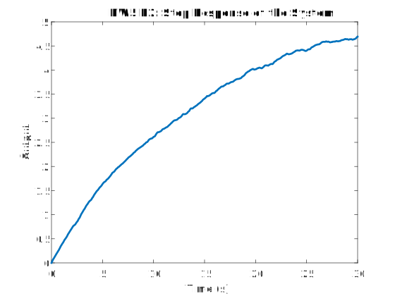
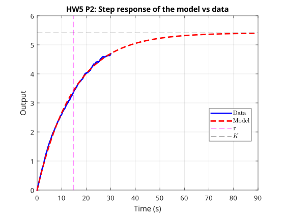

---
geometry:
  - margin=2cm
---

## Problem 2

We are given the step response data of a stable system, which looks like this:

We can observe that the system output response appears to exponentially approaches a steady state value. Hence we can assume that the system is a linear first order system. The ODE for a first order linear system is given by:

$$
\tau \dot{x} + x(t) = K u(t)
$$

Where $\tau$ is the time constant, $K$ is the gain, $u(t)$ is the system input, and $x(t)$ is the system output. Given the limited data, the system does not actually approach the steady state within the time span of the data so we cannot directly use the steady state value to find $K$ and $\tau$.

We can instead use the least squares method to fit the data to the first order system model. The first order system model can be rewritten as:

$$
\begin{aligned}
\tau \dot{x} + x(t) &= K u(t) \\
\dot{x} \tau - u(t) K &= -x(t) \quad (1) \\
\end{aligned}
$$

Where we have the data for $x(t)$, $\dot{x}(t)$ can be computed by using the finite difference method $\dot{x}(t) = \frac{x(t + \Delta t) - x(t)}{\Delta t}$ and $u(t)$ is the step input

$$
u(t) = \begin{cases}
0 & t < 0\\
1 & t \geq 0
\end{cases}
$$

Since we only have data for $t \geq 0$, we can assume that $u(t) = 1$.

Using the finite difference method works when the data is not noisy, but we can see from the data that it is quite noisy and does not follow a smooth exponential curve. Hence, starting from the initial time $t_0$ we can integrate both sides of equation (1) till each timestep $t$ of the data to get:

$$
\begin{aligned}
\int_{t_0}^{t} (\dot{x} \tau - u(t) K) dt &= -\int_{t_0}^{t} x(t) dt \\
x(t) \tau - tK &= -\int_{t_0}^{t} x(t) dt \\
\end{aligned}
$$

Now we can stack all the data points from $t_0$ to $t_N$ where $t_N$ is the final time to form a matrix equation of the form:

$$
\underbrace{
\begin{bmatrix}
x(t_0) & -t_0 \\
x(t_1) & -t_1 \\
\vdots & \vdots \\
x(t_N) & -t_N \\
\end{bmatrix}
}_{A}
\underbrace{
\begin{bmatrix}
\tau \\
K
\end{bmatrix}
}_{\theta}
=
\underbrace{
\begin{bmatrix}
-\int_{t_0}^{t_0} x(t) dt \\
-\int_{t_0}^{t_1} x(t) dt \\
\vdots \\
-\int_{t_0}^{t_N} x(t) dt \\
\end{bmatrix}
}_{b}
$$

Where $b$ can be constructed by sequentially adding the values of $x(t)$ to value of the previous timestep and multiplying by the time difference for a zero order hold integration.

We can find the least squares solution to the above equation, which gives us the following $\tau$ and $K$:

$$
\tau = 14.790, \quad K = 5.412
$$

We can now use the values of $\tau$ and $K$ to construct the transfer function of our first order ODE

$$
\begin{aligned}
\tau \dot{x} + x(t) &= K u(t) \\
\tau s X(s) + X(s) &= K U(s) \\
X(s) (\tau s + 1) &= K U(s) \\
\implies \frac{X(s)}{U(s)} &= \frac{K}{\tau s + 1} \\
\implies G(s) &= \frac{K}{\tau s + 1} \\
\end{aligned}
$$

Plotting the step response of the transfer function with the output data we get the following:

The model's step response matches the given data and we can be assured that the system has been identified correctly
