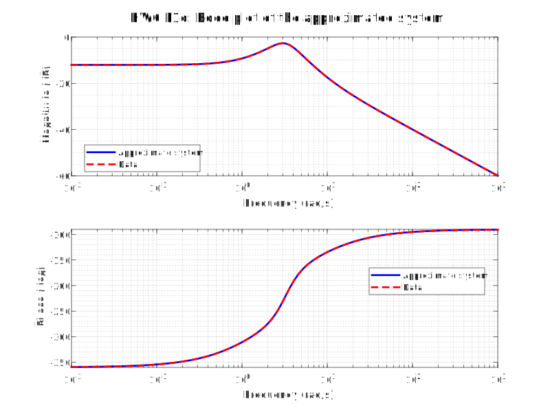

---
geometry:
  - margin=2cm
---

# ME599 Homework 6 - Akshat Dubey

## Problem 1

Given the general transfer function:

$$
\begin{aligned}
G(s) &= \frac{b_0 + b_1 s + b_2 s^2 + \ldots + b_m s^m}{a_0 + a_1 s + a_2 s^2 + \ldots + a_n s^n} \\
\text{multiply by } & \frac{a_n}{a_n} \text{ and abuse notation such that } \\
b_0 &= \frac{b_0}{a_n} \dots, \quad a_0 = \frac{a_0}{a_n} \dots \\
G(s) &= \frac{b_0 + b_1 s + b_2 s^2 + \ldots + b_m s^m}{a_0 + a_1 s + a_2 s^2 + \ldots a_{n-1} s^{n-1} + s^n} \\
\end{aligned}
$$

we need to come up with the least squares formulation for the coefficients $b_i$ and $a_i$ from the frequency response $G(j\omega)$ collected from an experiment.

### Problem 1.a

Let $G(j\omega) = G_R + j G_I$ be the complex frequency response, with $G_R$ and $G_I$ being the real and imaginary parts respectively. By setting $s = j\omega$, and using the complex frequency response, we can rewrite the equation given in the problem as

$$
(a_0 + a_1 j\omega + a_2 (j\omega)^2 + \ldots a_{n-1}(j \omega)^{n-1} + (j \omega)^n) (G_R + j G_I) = (b_0 + b_1 j\omega + b_2 (j\omega)^2 + \ldots + b_m(j \omega)^m)
$$

Noting that

$$
(j \omega)^p = \begin{cases}
(-1)^{p/2} \omega^p & \text{if } p \text{ is even} \\
j (-1)^{(p-1)/2} \omega^p & \text{if } p \text{ is odd}
\end{cases}
$$

we can rewrite the above equation as

$$
\begin{aligned}
(a_0 + a_1j\omega + a_2(-1)^{2/2}\omega^2 + \ldots + a_{n-1}(j \omega)^{n-1} + (j \omega)^n) (G_R + j G_I) &= b_0 + b_1j\omega + b_2(-1)^{2/2}\omega^2 + \ldots + b_m(j\omega)^m \\
(a_0 + a_1j\omega - a_2\omega^2 + \ldots + a_{n-1}(j \omega)^{n-1} + (j \omega)^n) (G_R + j G_I) &= b_0 + b_1j\omega - b_2\omega^2 + \ldots + b_m(j\omega)^m \\
a_0 G_R + a_0 j G_I + a_1 j \omega G_R - a_1 \omega G_I - a_2 \omega^2 G_R - a_2 \omega^2 j G_I + \ldots \\
+ a_{n-1}(j \omega)^{n-1}G_R + a_{n-1}(j \omega)^{n-1}jG_I + (j \omega)^n G_R +  (j \omega)^n G_I &=
b_0 + b_1 j \omega - b_2 \omega^2  + \ldots + b_m (j \omega)^m
\end{aligned}
$$

assuming that $n$ and $m$ are both even, we can separate the real and imaginary parts. The real part can be expressed as

$$
\begin{aligned}
a_0 G_R - a_1 \omega G_I - a_2 \omega^2 G_R + \ldots + a_{n-1}(j \omega)^{n-1} jG_I + (j \omega)^n G_R = b_0 - b_2 \omega^2 + b_4 \omega^4 + \ldots + b_m (j \omega)^m \\
-a_0 G_R + a_1 \omega G_I + a_2 \omega^2 G_R + \ldots - a_{n-1}(j \omega)^{n-1} jG_I + b_0 - b_2 \omega^2 + b_4 \omega^4 + \ldots + b_m (j \omega)^m = (j \omega)^n G_R
\end{aligned}
$$

Similarly, the imaginary part can be expressed as

$$
\begin{aligned}
a_0 G_I + a_1 \omega G_R - a_2 \omega^2 G_I + \ldots + a_{n-1}(j \omega)^{n-1} G_R + (j \omega)^n G_I = b_1 \omega - b_3 \omega^3 + \ldots + b_{m-1} (j \omega)^{m-1} \\
-a_0 G_I - a_1 \omega G_R + a_2 \omega^2 G_I + \ldots - a_{n-1}(j \omega)^{n-1} G_R + b_1 \omega - b_3 \omega^3 + \ldots + b_{m-1} (j \omega)^{m-1} = (j \omega)^n G_I
\end{aligned}
$$

These equations can be expressed in matrix form as

$$
\begin{bmatrix}
-G_R & \omega G_I & \ldots & -(j \omega)^{n-1} j G_I & 1 & 0 & -\omega^2 & \ldots & 0 & (j \omega)^m \\
-G_I & -\omega G_R & \ldots & -(j \omega)^{n-1} G_R & 0 & \omega & 0 & \ldots & (j \omega)^{m-1} & 0 \\
\end{bmatrix}
\begin{bmatrix}
a_0 \\
\vdots \\
a_{n-1} \\
b_0 \\
\vdots \\
b_m
\end{bmatrix}
= \begin{bmatrix}
(j \omega)^n G_R \\
(j \omega)^n G_I
\end{bmatrix}
$$

In the case that $n$ is odd, in the coefficient matrix the coefficient of $a_{n-1}$, $(j \omega)^{n-1} G_R$ would be in the real part and $(j \omega)^{n-1} j G_I$ would be in the imaginary part.
Similarly for the vector in the RHS, $(j \omega)^n G_I$ would be the real part and $(j \omega)^n G_R$ would be the imaginary part.

In the case that $m$ is odd, in the coefficient matrix the coefficient of $b_{m-1}$, $(j \omega)^{m-1}$ would end up being in the real part and the coefficient of $b_m$, $(j \omega)^m$ would end up being in the imaginary part.

### Problem 1.b

Assuming $m$ and $n$ are even, we can stack the equations from the previous part for multiple frequencies($\omega_1$ to $\omega_k$), and express the problem as

$$
\underbrace{
\begin{bmatrix}
-G_R(\omega_1) & \omega_1 G_I(\omega_1) & \ldots & -(j \omega_1)^{n-1} j G_I(\omega_1) & 1 & 0 & -\omega_1^2 & \ldots & 0 & (j \omega_1)^m \\
-G_I(\omega_1) & -\omega_1 G_R(\omega_1) & \ldots & -(j \omega_1)^{n-1} G_R(\omega_1) & 0 & \omega_1 & 0 & \ldots & (j \omega_1)^{m-1} & 0 \\
-G_R(\omega_2) & \omega_2 G_I(\omega_2) & \ldots & -(j \omega_2)^{n-1} j G_I(\omega_2) & 1 & 0 & -\omega_2^2 & \ldots & 0 & (j \omega_2)^m \\
-G_I(\omega_2) & -\omega_2 G_R(\omega_2) & \ldots & -(j \omega_2)^{n-1} G_R(\omega_2) & 0 & \omega_2 & 0 & \ldots & (j \omega_2)^{m-1} & 0 \\
\vdots & \vdots & \ddots & \vdots & \vdots & \vdots & \vdots & \vdots & \vdots & \vdots \\
-G_R(\omega_k) & \omega_k G_I(\omega_k) & \ldots & -(j \omega_k)^{n-1} j G_I(\omega_k) & 1 & 0 & -\omega_k^2 & \ldots & 0 & (j \omega_k)^m \\
-G_I(\omega_k) & -\omega_k G_R(\omega_k) & \ldots & -(j \omega_k)^{n-1} G_R(\omega_k) & 0 & \omega_k & 0 & \ldots & (j \omega_k)^{m-1} & 0 \\
\end{bmatrix}
}_{A}
\underbrace{
\begin{bmatrix}
a_0 \\
\vdots \\
a_{n-1} \\
b_0 \\
\vdots \\
b_m
\end{bmatrix}
}_{\theta}
= \underbrace{
\begin{bmatrix}
(j \omega_1)^n G_R(\omega_1) \\
(j \omega_1)^n G_I(\omega_1) \\
(j \omega_2)^n G_R(\omega_2) \\
(j \omega_2)^n G_I(\omega_2) \\
\vdots \\
(j \omega_k)^n G_R(\omega_k) \\
(j \omega_k)^n G_I(\omega_k)
\end{bmatrix}
}_{b}
$$

If either $m$ or $n$ is odd, we can follow the same rules as defined at the end of part (a) to change the matrices $A$ and $b$.

and solve for the coeffients $a_i$ and $b_i$ in $\theta$ using the least squares method, where

$$
\theta^* = (A^TA)^{-1}A^Tb
$$

### Problem 1.c

The MATLAB scrpt is included as an appendix, and constructs the matrices $A$ and $b$ as described above, then solves for $\theta$ using the least squares method.

### Problem 1.d

In the file `freq_resp_data.mat`, we are given the frequency response data for 77 different frequencies, so $k=77$. We given the phase offset and amplitude of the output of the system, so we can use that to construct $G(j\omega)$, where

$$
\begin{aligned}
G_R &= \text{amplitude} \cdot \cos(\text{phase offset}) \\
G_I &= \text{amplitude} \cdot \sin(\text{phase offset})
\end{aligned}
$$

We can construct the $A$ and $b$ matrices as described above, but in a programmatic way that allows us to input odd values of $m$ and $n$ and solve for $\theta$ to find the model of the system.

We can then loop over multiple values of $m$ and $n$, making sure we only try values that make the transfer function proper $m \leq n$ to find the values that provide the best fit to the data.

$$
||A \theta - b||_2^2
$$

The best fit is obtained for $m=2$ and $n=3$, which gives us the transfer function

$$
G(s) = \frac{s^2 + 10 s + 10}{s^3 + s^2 + 0.2 s + 40}
$$

And the bode plot of the system is

