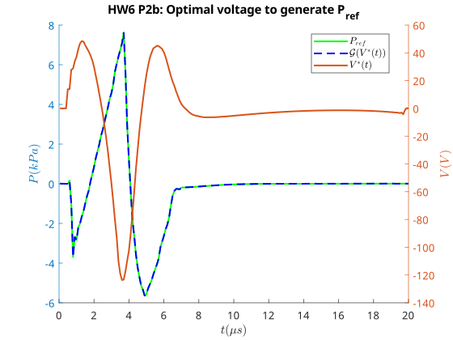

---
geometry:
  - margin=2cm
---

## Problem 2

For this problem, we will try to identify the transfer function for the model provided in Homework 4 in the `piezoNozzle.p` file. The model is a linear system as determined in Hwk 4 with a timestep of 0.1 $\mu s$.

### Problem 2.a

We can describe this model by a difference equation. A difference equation is similar to a differential equation, but in discrete time, and it relates the current output of the system to past outputs and inputs. A difference equation can be expressed in the form:

$$
y(k) + a_1 y(k-1) + \ldots + a_n y(k-n) = b_1 u(k) + \ldots + b_m u(k-m)
$$

The order of the system is determined by $m$ and $n$, which are an indication of how far back in time the control inputs and outputs are relevant.

Since the model is linear, we can use ARX(AutoRegressive with Extra input) model to identify the system. To do that, we first send a random sequence of inputs into the system and generate outputs. Because we need to compare our results with `P_ref.mat`, we have to use a sample time of 0.1s as was used when generating the reference. I generated 500 random samples of $u(k)$ and used this sequence to get 500 samples of $y(k)$.

Now, for each generated $y(k)$, we want to find the coefficients $a_i, b_i$ that when multiplied by the previous $u$ s and $y$ s will get us an answer close to the $y(k)$. Based on what order we choose, we will have $n+m$ coefficients and equations. So that we have $n+m$ independent equations, we form equations between time instances $k=N_1$ and $k=N_2$ where $N_2-N_1 > max(m,n)$ and $N_1 > max(m,n)$.

We can formulte this as a least squares problem:

$$
\underbrace{\begin{bmatrix}
y(N_1) \\\vdots \\ y(N_2)
\end{bmatrix}}_{b}
= \underbrace{\begin{bmatrix}
-y(N_1-1) & \ldots & -y(N_1-n) & u(N_1) & \ldots & u(N_1-m) \\
\vdots & \ddots & \vdots & \vdots & \ddots & \vdots \\
-y(N_2-1) & \ldots & -y(N_2-n) & u(N_2) & \ldots & u(N_2-m)
\end{bmatrix}}_{A}
\underbrace{\begin{bmatrix}
a_1 \\\vdots \\ a_n \\ b_1 \\\vdots \\ b_m
\end{bmatrix}}_{\theta}
$$

and the optimal solution is given by:

$$
\theta^* = (A^T A)^{-1} A^T b
$$

This least squares problem was solved with $m$ and $n$ in the range of 5 to 10 as suggested in the problem to get the coefficients. To determine the best order, we select the $m$ and $n$ that minimize the following cost function:

$$
||b - A \theta^*||_2
$$

Once we have the best order and its coefficients, the difference equation can be converted to a discrete time transfer function using the Z-transform

$$
\begin{aligned}
y(k) + a_1 y(k-1) + \ldots + a_n y(k-n) &= b_1 u(k) + \ldots + b_m u(k-m) \\
\text{Taking Z-transform, }& \\
Y(z) + a_1 z^{-1} Y(z) + \ldots + a_n z^{-n} Y(z) &= b_1 U(z) + \ldots + b_m z^{-m} U(z) \\
Y(z) (1 + a_1 z^{-1} + \ldots + a_n z^{-n}) &= U(z) (b_1 + b_2 z^{-1} + \ldots + b_m z^{-m}) \\
\frac{Y(z)}{U(z)} &= \frac{b_1 + b_2 z^{-1} + \ldots + b_m z^{-m}}{1 + a_1 z^{-1} + \ldots + a_n z^{-n}} \\
\text{Converting to polynomial form,} &\text{ with the higest order being } n \\
\frac{Y(z)}{U(z)} &= \frac{b_1 z^n + b_2 z^{n-1} + \ldots + b_m z^{n-m}}{z^n + a_1 z^{n-1} + \ldots + a_n} \\
\text{where } b_i = 0 \text{ for } i > m \text{ since } m & \leq n\text{ for a proper transfer function} \\
\text{(basically all coefficients of orders of}&\text{ the numerator that are smaller than m are zero)}
\end{aligned}
$$

This way, we can construct a transfer function in MATLAB, with numerator as $[b_1, b_2, \ldots, b_m, 0\times(n-m+1)]$ and denominator as $[1, a_1, \ldots, a_n]$. The best $m$ and $n$ are determined to be 10 for both as can be seen in the table below while making sure that the transfer function is proper $(m \leq n)$.

|        | $n=5$         | $n=6$         | $n=7$         | $n=8$         | $n=9$         | $n=10$            |
| ------ | ------------- | ------------- | ------------- | ------------- | ------------- | ----------------- |
| $n=5$  | 272.2843e+000 | 214.8993e+000 | 206.1317e+000 | 190.9935e+000 | 135.1521e+000 | 95.8259e+000      |
| $n=6$  | Inf           | 169.2370e+000 | 167.9149e+000 | 127.7042e+000 | 92.6606e+000  | 84.5737e+000      |
| $n=7$  | Inf           | Inf           | 39.6386e+000  | 27.9621e+000  | 22.2111e+000  | 19.6407e+000      |
| $n=8$  | Inf           | Inf           | Inf           | 2.0156e+000   | 2.0135e+000   | 2.0064e+000       |
| $n=9$  | Inf           | Inf           | Inf           | Inf           | 544.9197e-003 | 543.4382e-003     |
| $n=10$ | Inf           | Inf           | Inf           | Inf           | Inf           | **218.9867e-003** |

And the transfer function is as follows:

$$
G(z) = \frac{5.516e-07 z^{10} + 0.01165 z^{9} - 0.1152 z^{8} + 0.04481 z^{7} + 0.4392 z^{6} - 0.662 z^{5} + 0.1977 z^{4} + 0.355 z^{3} - 0.4052 z^{2} + 0.1341 z}{z^{10} - 2.561 z^{9} + 2.711 z^{8} - 1.341 z^{7} - 0.5648 z^{6} + 1.817 z^{5} - 1.777 z^{4} + 0.851 z^{3} - 0.1909 z^{2} + 0.05781 z - 1.865e-5}
$$

When using MATLAB's system ID toolbox, we need to set $n_a=n$, $n_b=m$ and $n_k=0$ since we have no dead time in the system and $y(k)$ is affected by $u(k)$ directly. For MATLAB's toolbox, we can make our decision based on the MSE, $m=n=10$ as shown in bold in the table below.

|        | $n=5$         | $n=6$        | $n=7$        | $n=8$        | $n=9$         | $n=10$           |
| ------ | ------------- | ------------ | ------------ | ------------ | ------------- | ---------------- |
| $n=5$  | 148.2774e+000 | 92.3634e+000 | 84.9805e+000 | 72.9571e+000 | 36.5322e+000  | 18.3652e+000     |
| $n=6$  | Inf           | 57.2823e+000 | 56.3908e+000 | 32.6167e+000 | 17.1720e+000  | 14.3054e+000     |
| $n=7$  | Inf           | Inf          | 3.1424e+000  | 1.5638e+000  | 986.6686e-003 | 771.5156e-003    |
| $n=8$  | Inf           | Inf          | Inf          | 8.1254e-003  | 8.1082e-003   | 8.0512e-003      |
| $n=9$  | Inf           | Inf          | Inf          | Inf          | 593.8750e-006 | 590.6502e-006    |
| $n=10$ | Inf           | Inf          | Inf          | Inf          | Inf           | **95.9104e-006** |

This gives us the transfer function

$$
G(z) = \frac{5.516e-07 z^{10} + 0.01165 z^{9} - 0.1152 z^{8} + 0.04481 z^{7} + 0.4392 z^{6} - 0.662 z^{5} + 0.1977 z^{4} + 0.355 z^{3} - 0.4052 z^{2} + 0.1341 z}{z^{10} - 2.561 z^{9} + 2.711 z^{8} - 1.341 z^{7} - 0.5648 z^{6} + 1.817 z^{5} - 1.777 z^{4} + 0.851 z^{3} - 0.1909 z^{2} + 0.05781 z - 1.865e-5}
$$

Which is the same as the one we got from the doing ARX manually. Hence, we can assume that the manual ARX method is correct.

In the following plots, $P$ is the pressure wave generated by `V_example.mat` using the actual system dynamics, $P_{manual}$ is the pressure wave generated by the system identified by manual ARX method, and $P_{matlab}$ is the pressure wave generated by the system identified by MATLAB's system ID toolbox.

We can see that both the manual and MATLAB ARX methods give us a very good approximation of the system, and both models have similar norm of errors:

- Manual ARX($||P-P_{manual}||_2$): 0.134917
- MATLAB ARX($||P-P_{matlab}||_2$): 0.134917

$\pagebreak$

### Problem 2.b

For this problem, we want to design a controller such that the system produces the desred pressure wave `P_ref.mat`. We start by constructing a state space representation and then making an impulse response matrix to solve the least squares solution to compute the best control input $V^*(t)$.

The state space representation of the system using can be found by using MATLAB's `ss` function. We can then use this state space representation to compute the impulse response matrix.

$$
\underbrace{\begin{bmatrix}
y(0) \\ y(1) \\ y(2) \\\vdots \\ y(N-1)
\end{bmatrix}}_{y} = \underbrace{\begin{bmatrix}
0 & 0 & \ldots & 0 & 0 \\
CB & 0 & \ldots & 0 & 0 \\
CAB & CB & \ldots & 0 & 0 \\
\vdots & \vdots & \ddots & \vdots \\
CA^{N-2}B & CA^{N-3}B & \ldots & CB & 0 \\
\end{bmatrix}}_{\mathcal{G}}
\underbrace{\begin{bmatrix}
u(0) \\ u(1) \\ u(2) \\\vdots \\ u(N-1)
\end{bmatrix}}_{u}
+ \begin{bmatrix}
Cx(0) \\ CAx(0) \\ CA^2x(0) \\\vdots \\ CA^{N-1}x(0)
\end{bmatrix}
$$

Assuming $x(0)=0$, we can ignore the second term and thus $y = \mathcal{G} u$. We can then use the pseudoinverse of $\mathcal{G}$ to compute the best control input $V^*(t)$ that will give us the desired pressure wave.

$$
V^*(t) = \mathcal{G}^+ P_{ref}
$$

Where $\mathcal{G}^+$ is the pseudoinverse of $\mathcal{G}$.

The $V^*(t)$ is then used to compute the pressure wave $P(t)$ using the system dynamics in `piezoNozzle.p`. We can see that the pressure wave generated by the system using $V^*(t)$ is very close to the desired pressure wave, so the controller is working well.

