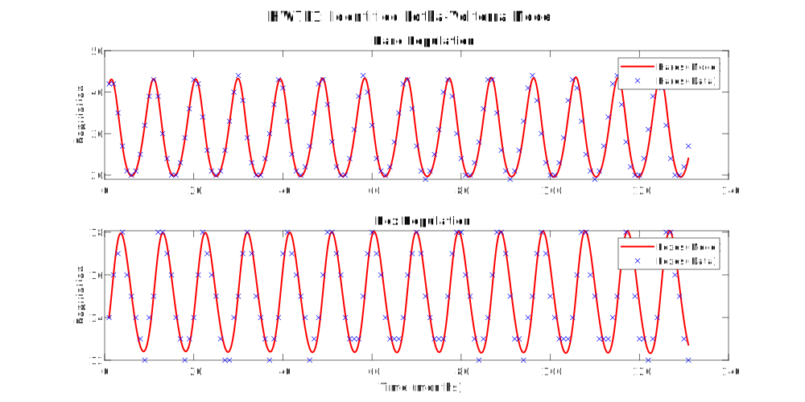
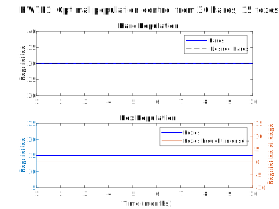
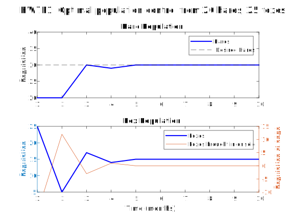
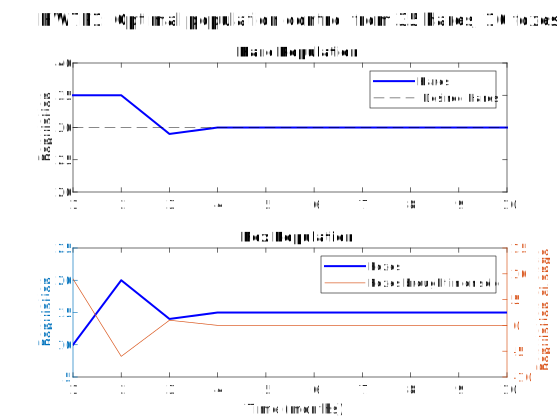

---
geometry:
  - margin=2cm
---

# ME599 Homework 7 - Akshat Dubey

## Problem 1

We want to develop a control algorithm to control the hare population in a park at 30 each month. The hares are preyed upon by foxes, and the prey-predator dynamics can be captured by the Lotka-Volterra equations:

$$
\begin{aligned}
\dot{x} &= \alpha x - \beta xy \\
\dot{y} &= -\gamma y + \delta xy
\end{aligned}
$$

Where

- $x$: hare population
- $y$: fox population
- $\alpha$: hare growth rate
- $\beta$: hare death rate due to predation
- $\gamma$: fox death rate
- $\delta$: fox growth rate due to predation

The timestep here is 1 month or 4 weeks, and the population data every 4 weeks is provided in `fox_hare.mat`.

Since this is a first order nonlinear system, we can use a least squares method like we did in HW5 to find the parameters because we know the form of the system. Instead of keeping the equation in its current form and having to use finnite difference to compute derivatives, we can integrate both sides between the initial time $t_0$ and $t$ to get:

$$
\begin{aligned}
\int_{t_0}^{t} \dot{x} dt &= \int_{t_0}^{t} (\alpha x - \beta xy) dt \\
x(t) - x(t_0) &= \alpha \int_{t_0}^{t} x(t) dt - \beta \int_{t_0}^{t} x(t) y(t) dt \\
\int_{t_0}^{t} \dot{y} dt &= \int_{t_0}^{t} (-\gamma y + \delta xy) dt \\
y(t) - y(t_0) &= -\gamma \int_{t_0}^{t} y(t) dt + \delta \int_{t_0}^{t} x(t) y(t) dt
\end{aligned}
$$

Im matrix form,

$$
\begin{bmatrix}
x(t) - x(t_0) \\
y(t) - y(t_0)
\end{bmatrix} =
\begin{bmatrix}
\int_{t_0}^{t} x(t) dt & -\int_{t_0}^{t} x(t) y(t) dt & 0 & 0 \\
0 & 0 & -\int_{t_0}^{t} y(t) dt & \int_{t_0}^{t} x(t) y(t) dt
\end{bmatrix}
\begin{bmatrix}
\alpha \\
\beta \\
\gamma \\
\delta
\end{bmatrix}
$$

We can then stack these for multiple time steps from $t_0$ to $t_n$, where $t_0$ is the first month where we have data.
We then get a system of equations in the form of $A\theta = b$

$$
\underbrace{\begin{bmatrix}
\int_{t_0}^{t_0} x(t) dt & -\int_{t_0}^{t_0} x(t) y(t) dt & 0 & 0 \\
0 & 0 & -\int_{t_0}^{t_0} y(t) dt & \int_{t_0}^{t_0} x(t) y(t) dt \\
\int_{t_0}^{t_1} x(t) dt & -\int_{t_0}^{t_1} x(t) y(t) dt & 0 & 0 \\
0 & 0 & -\int_{t_0}^{t_1} y(t) dt & \int_{t_0}^{t_1} x(t) y(t) dt \\
\vdots & \vdots & \vdots & \vdots \\
\int_{t_0}^{t_n} x(t) dt & -\int_{t_0}^{t_n} x(t) y(t) dt & 0 & 0 \\
0 & 0 & -\int_{t_0}^{t_n} y(t) dt & \int_{t_0}^{t_n} x(t) y(t) dt
\end{bmatrix}}_{A}
\underbrace{\begin{bmatrix}
\alpha \\
\beta \\
\gamma \\
\delta
\end{bmatrix}}_{\theta} =
\underbrace{\begin{bmatrix}
x(t_0) - x(t_0) \\
y(t_0) - y(t_0) \\
x(t_1) - x(t_0) \\
y(t_1) - y(t_0) \\
\vdots \\
x(t_n) - x(t_0) \\
y(t_n) - y(t_0)
\end{bmatrix}}_{b}
$$

Where the least squares solution is given by:

$$
\theta^* = (A^TA)^{-1}A^Tb
$$

After constructing the matrices, the least squares solution found is

$$
\theta^* = \begin{bmatrix}
\alpha^* \\
\beta^* \\
\gamma^* \\
\delta^*
\end{bmatrix} = \begin{bmatrix}
1.401247 \\
0.093308 \\
0.318335 \\
0.010616
\end{bmatrix}
$$

with a squared error of $52.6$.

We can see that the model fits the data well, and so can be used for controlling the hare population. If we want to use any advanced techniques like LQR or MPC, we need to linearize the system around the equilibrium point. The equilibrium points of the system can be found by setting $\dot{x} = 0$ and $\dot{y} = 0$:

$$
\begin{aligned}
\dot{x} &= \alpha x - \beta xy = 0 \\
\dot{y} &= -\gamma y + \delta xy = 0 \\
&\text{Bringing the negative terms to the other side} \\
\alpha x &= \beta xy \\
\gamma y &= \delta xy \\
&\text{Dividing both sides by } x \text{ and } y \text{ respectively} \\
y_e &= \frac{\alpha}{\beta} \\
x_e &= \frac{\gamma}{\delta}
\end{aligned}
$$

Substituting the values of $\alpha$, $\beta$, $\gamma$ and $\delta$ we found earlier, we get the equilibrium points as $x_e = 29.985193$ and $y_e = 15.017423$. Since we want to keep the hare population at $30$, we can use this as the equilibrium point for our linearization as it is very close to the desired population. We also know that the control input $u$ here is the number of foxes added, which will only affect the value of $y$. At the equilibrium, $u_e=0$ as well. To express this system in a linear state space form, we can find the jacobian of the system with respect to $\boldsymbol{x}$ and $u$ at the equilibrium point. Starting from the original nonlinear equations in state space form with the additional control input $u$:

$$
\begin{aligned}
\boldsymbol{\dot{x}} =
\begin{bmatrix}
\dot{x} \\
\dot{y}
\end{bmatrix} &= f(\boldsymbol{x},u) \\
&= \begin{bmatrix}
\alpha x - \beta xy \\
-\gamma y + \delta xy + u
\end{bmatrix}
\end{aligned}
$$

We find the jacobian $\nabla_x f$ as:

$$
\begin{aligned}
\nabla_x f &= \begin{bmatrix}
\frac{\partial f_1}{\partial x} & \frac{\partial f_1}{\partial y} \\
\frac{\partial f_2}{\partial x} & \frac{\partial f_2}{\partial y}
\end{bmatrix} \\
\frac{\partial f_1}{\partial x} &= \alpha - \beta y \\
\frac{\partial f_1}{\partial y} &= -\beta x \\
\frac{\partial f_2}{\partial x} &= \delta y \\
\frac{\partial f_2}{\partial y} &= -\gamma + \delta x \\
\implies
\nabla_x f &= \begin{bmatrix}
\alpha - \beta y & -\beta x \\
\delta y & -\gamma + \delta x
\end{bmatrix}
\end{aligned}
$$

and the jacobian $\nabla_u f$ as:

$$
\begin{aligned}
\nabla_u f &= \begin{bmatrix}
\frac{\partial f_1}{\partial u} \\
\frac{\partial f_2}{\partial u}
\end{bmatrix} \\
\frac{\partial f_1}{\partial u} &= 0 \\
\frac{\partial f_2}{\partial u} &= 1 \\
\implies
\nabla_u f &= \begin{bmatrix}
0 \\
1
\end{bmatrix}
\end{aligned}
$$

Then we get $A_c$ and $B_c$ by evaluating the jacobian at the equilibrium point:

$$
A_c = \nabla_x f \bigg|_{(x_e,y_e)}
$$

$$
B_c = \nabla_u f \bigg|_{(x_e,y_e)}
$$

The linearized continuous time system is then given by:

$$
\dot{\delta \boldsymbol{x}} = A_c \delta \boldsymbol{x} + B_c \delta u
$$

Where $\delta \boldsymbol{x} = \begin{bmatrix} x - x_e \\ y - y_e \end{bmatrix}$ and $\delta u = u - u_e$, which are small deviations from the equilibrium point.

We can then convert this continuous time linear system to a discrete time system using MATLAB's `c2d` function with a zero order hold to get the discrete time system with the matrices $A_d, B_d$.

$$
\boldsymbol{x}_{k+1} = A_d \boldsymbol{x_k} + B_d u_k \\
$$

Checking the eigenvalues of $A_d$ we get:

- 0.7851 + 0.6193i
- 0.7851 - 0.6193i

Both the eigenvalues have a magnitude $\leq 1$, which means the system is stable at the equilibrium point. Hence, from a given starting hare and fox population, we need to control the hare population till it reaches the equilibrium point.
We can design a Linear Quadratic Regulator (LQR) using this linear model to get the population to the equilibrium. The discrete-time LQR controller has the cost function:

$$
J = \sum_{k=0}^{\infty} \left( \boldsymbol{x}_k^T Q \boldsymbol{x}_k + u_k^T R u_k \right)
$$

Where $Q$ and $R$ are the weights for the state and control input respectively. We only care about the hare population, so we can set $Q = \begin{bmatrix} 10 & 0 \\ 0 & 1 \end{bmatrix}$ and $R = 2$. The optimal control gain matrix $K$ is given by the solution to the discrete-time algebraic Riccati equation (DARE), which can be solved using MATLAB's `dlqr` function. Once we have the optimal control law, we can get the optimal control input $u_k$ to drive the system to the equilibrium point:

$$
\begin{aligned}
u_k &= -K (\boldsymbol{x}_k - \boldsymbol{x}_e) \\
\end{aligned}
$$

When simulating the population dynamics and the controller, we round $\boldsymbol{x}_k$ and $u_k$ to the nearest integer at the end of each month since the animal population can only be integers at the end of each month. We then hold this value of $u_k$ for one month while the population dynamics of the foxes and hares evolve. Simulating this system with the optimal control input, we get the following evolution of populations for various initial conditions:

{width=70%}

{width=70%}

{width=70%}

We can see that the controller is able to keep the hare population at 30 as desired by the manager under different initial conditions and hence the controller is robust.
