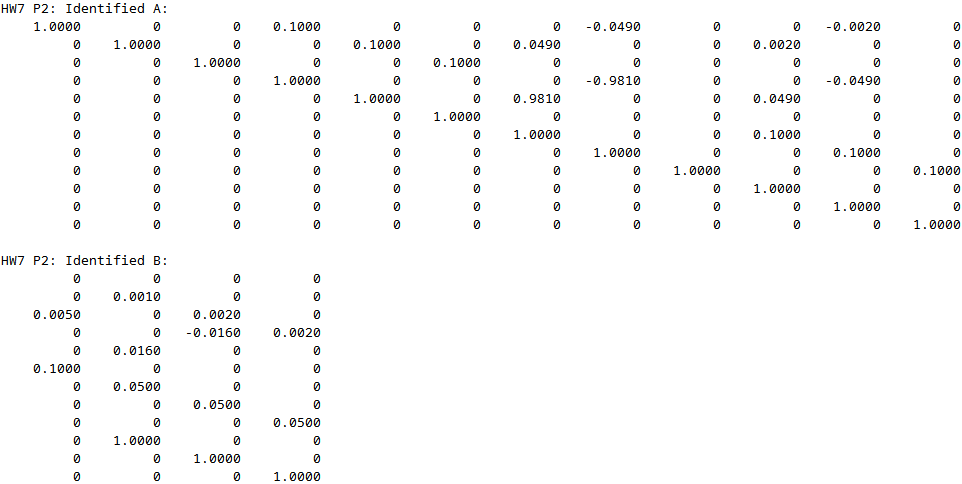
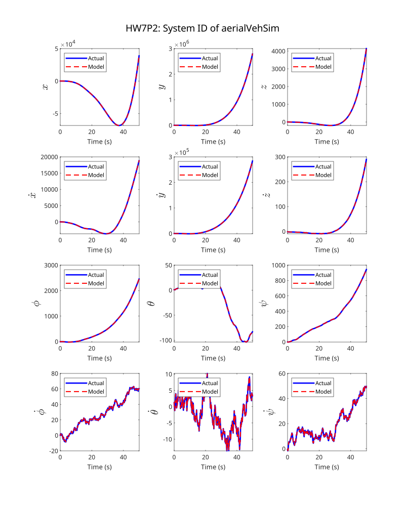
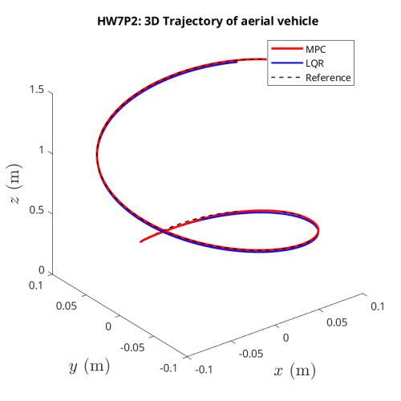
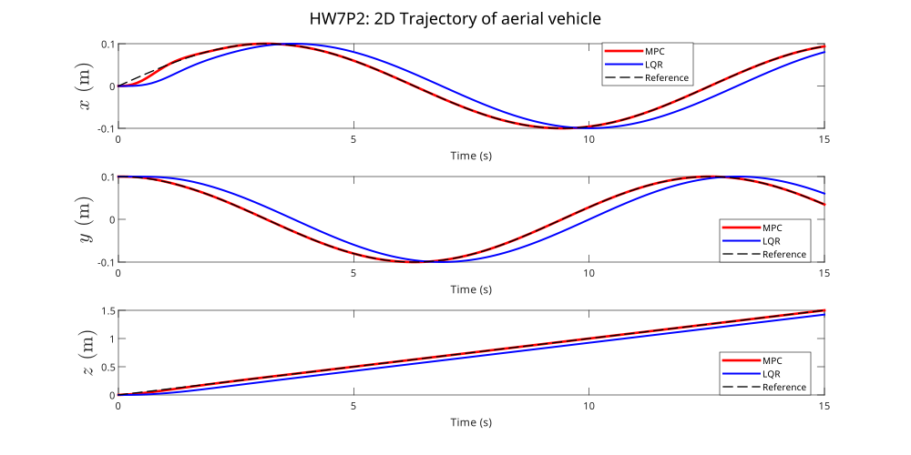

---
geometry:
  - margin=2cm
---

## Problem 2

### Problem 2.a

We need to identify the discrete-time system in `aerialVehSim.p`, which has been identified as a linear system in Homework 5. We have the state $\boldsymbol{x}$ and control input $\boldsymbol{u}$:

$$
\boldsymbol{x} = \begin{bmatrix}
x \\ y \\ z \\ \dot{x} \\ \dot{y} \\ \dot{z} \\ \phi \\ \theta \\ \psi \\ \dot{\phi} \\ \dot{\theta} \\ \dot{\psi}
\end{bmatrix} \in \mathbb{R}^{12}
,\quad
\boldsymbol{u} = \begin{bmatrix}
u_1 \\ u_2 \\ u_3 \\ u_4
\end{bmatrix} \in \mathbb{R}^{4} \\
\quad n = 12, \quad m = 4
$$

The dynamics are given by the function $F =$ `aerialVehSim.p` in discrete time for the given time step $Ts=0.1$:

$$
\boldsymbol{x}_{k+1} = F(\boldsymbol{x}_k, u_k, Ts)
$$

We will attempt to identify the system by using DMD with control as outlined [here](https://www.youtube.com/watch?v=K-7l0q920io). Given a discrete time system of the form $\boldsymbol{x}_{k+1} = A\boldsymbol{x}_k + B\boldsymbol{u}_k$, we first collect data the system given an initial state $\boldsymbol{x}_0$ and random control inputs ${\boldsymbol{u}_0, \boldsymbol{u}_1, \ldots, u_{N-1}}$ that produce state trajectories ${\boldsymbol{x}_1, \boldsymbol{x}_2, \ldots, \boldsymbol{x}_{N}}$. We can then stack this data into matrices $X, X'$ and $U$:

$$
X = \begin{bmatrix}
\vdots & \vdots & \ldots & \vdots \\
\boldsymbol{x}_0 & \boldsymbol{x}_1 & \ldots & \boldsymbol{x}_{N-1} \\
\vdots & \vdots & \ldots & \vdots
\end{bmatrix} \in \mathbb{R}^{n \times N}
,\quad
X' = \begin{bmatrix}
\vdots & \vdots & \ldots & \vdots \\
\boldsymbol{x}_1 & \boldsymbol{x}_2 & \ldots & \boldsymbol{x}_{N} \\
\vdots & \vdots & \ldots & \vdots
\end{bmatrix} \in \mathbb{R}^{n \times N}
,\quad
U = \begin{bmatrix}
\vdots & \vdots & \ldots & \vdots \\
\boldsymbol{u}_0 & \boldsymbol{u}_1 & \ldots & \boldsymbol{u}_{N-1} \\
\vdots & \vdots & \ldots & \vdots
\end{bmatrix} \in \mathbb{R}^{m \times N}
$$

Such that

$$
\begin{aligned}
X' &= A X + B U \\
&= \begin{bmatrix}
A & B
\end{bmatrix}
\begin{bmatrix}
X \\
U
\end{bmatrix}
\end{aligned}
$$

If $N > n$, we can solve for $A$ and $B$ using the least squares solution of $||X' - \begin{bmatrix} A & B \end{bmatrix} \begin{bmatrix} X \\ U \end{bmatrix}||_F$:

$$
\begin{bmatrix}
A & B
\end{bmatrix} = X' \begin{bmatrix}
X \\ U
\end{bmatrix}^+
$$

Where for a matrix $D$, $D^+$ is the pseudo-inverse of $D$

$$
D^+ = D^T (DD^T)^{-1}
$$

$\pagebreak$

After we have the compound matrix $\begin{bmatrix} A & B \end{bmatrix}$, we can extract $A$ and $B$ by splitting the matrix into two parts, extracting the first $n$ columns as $A$ and the last $m$ columns as $B$. The system was identified as follows:

Plotting the actual system against the identified system shows us that the identified system matches the actual system well, hence we can conclude that the system has been identified correctly.

$\pagebreak$

### Problem 2.b

We are given a reference trajectory $\boldsymbol{x}_{ref}$ which is of the form:

$$
\begin{bmatrix}
0.1sin\frac{t}{2} \\
0.1cos\frac{t}{2} \\
0.1t \\
0 \\
\vdots \\
0 \\
\end{bmatrix}
$$

which we need to track using an MPC controller. The MPC controller has the cost function:

$$
J = \frac{1}{2} \sum_{k=j}^{j+N-1} \left((\boldsymbol{x}_{ref}(k+1) - \boldsymbol{x}(k+1))^T Q (\boldsymbol{x}_{ref}(k+1) - \boldsymbol{x}(k+1)) + (\boldsymbol{u}(k)^T R \boldsymbol{u}(k))\right)
$$

Where $N=30$, $Q$ and $R$ are the weights on the state and control inputs respectively.

$$
Q = \begin{bmatrix}
10I_3 & 0_{3 \times 9} \\
0_{9 \times 3} & 0_{9 \times 9} \\
\end{bmatrix}, \quad
R = I_4
$$

We can assume that the first 3 states are observable and $x_0 = \begin{bmatrix} 0 & 0.1 & 0 & 0_{1 \times 9}\end{bmatrix}^T$.
To express the cost function as a function of the matrices we construct

$$
\begin{aligned}
X_k = \begin{bmatrix} x_k \\ x_{k+1} \\ \vdots \\ x_{k+N-1} \end{bmatrix} &\in \mathbb{R}^{nN \times 1} &
U_k = \begin{bmatrix} u_k \\ u_{k+1} \\ \vdots \\ u_{k+N-1} \end{bmatrix} &\in \mathbb{R}^{mN \times 1} \\
\bar{\mathcal{A}} = \begin{bmatrix} A_d \\ A_d^2 \\ \vdots \\ A_d^N \end{bmatrix} &\in \mathbb{R}^{nN \times n} &
\bar{\mathcal{B}} = \begin{bmatrix} B_d & 0 & \ldots & 0 \\ A_d B_d & B_d & \ldots & 0 \\ \vdots & \vdots & \ddots & \vdots \\ A_d^{N-1} B_d & A_d^{N-2} B_d & \ldots & B_d \end{bmatrix} &\in \mathbb{R}^{nN \times mN}
\end{aligned}
$$

Such that the sequence of states can be written as

$$
X_{k+1} = \bar{\mathcal{A}} x_k + \bar{\mathcal{B}} U_k
$$

then, let

$$
X_{ref} = \begin{bmatrix}
\boldsymbol{x}_{ref}(k+1) \\ \boldsymbol{x}_{ref}(k+2) \\ \vdots \\ \boldsymbol{x}_{ref}(k+N)
\end{bmatrix} \in \mathbb{R}^{12N \times 1}
$$

the cost matrices can be stacked into a diagonal matrices such that

$$
\begin{aligned}
\bar{Q} &= \text{diag}(Q, Q, \ldots, Q) \in \mathbb{R}^{12N \times 12N} \\
\bar{R} &= \text{diag}(R, R, \ldots, R) \in \mathbb{R}^{4N \times 4N}
\end{aligned}
$$

and the cost function becomes

$$
\begin{aligned}
J &= \frac{1}{2} ((X_{ref} - X_{k+1})^T \bar{Q} (X_{ref} - X_{k+1}) + U_k^T \bar{R} U_k) \\
&= \frac{1}{2} ((X_{ref} - (\bar{\mathcal{A}} x_k + \bar{\mathcal{B}} U_k))^T \bar{Q} (X_{ref} - (\bar{\mathcal{A}} x_k + \bar{\mathcal{B}} U_k)) + U_k^T \bar{R} U_k) \\
&= \frac{1}{2} (-2U_k^T \bar{\mathcal{B}}^T \bar{Q} (X_{ref} - \bar{\mathcal{A}} x_k) + U_k^T (\bar{\mathcal{B}}^T \bar{Q} \bar{\mathcal{B}} + \bar{R}) U_k + (X_{ref} - \bar{\mathcal{A}} x_k)^T \bar{Q} (X_{ref} - \bar{\mathcal{A}} x_k))
\end{aligned}
$$

The solution to get the optimal control sequence $U_k^*$ under no constraints is given by setting the derivative $\partial J / \partial U_k = 0$. Hence, we have

$$
\begin{aligned}
\frac{\partial J}{\partial U_k} &= -\bar{\mathcal{B}}^T \bar{Q} (X_{ref} - \bar{\mathcal{A}} x_k) + (\bar{\mathcal{B}}^T \bar{Q} \bar{\mathcal{B}} + \bar{R}) U_k = 0 \\
\implies \quad U_k^* &= (\bar{\mathcal{B}}^T \bar{Q} \bar{\mathcal{B}} + \bar{R})^{-1} \bar{\mathcal{B}}^T \bar{Q} (X_{ref} - \bar{\mathcal{A}} x_k) \\
\end{aligned}
$$

Then, at every time step, we pick the first element of the optimal control sequence $U_k^*$ as the control input $u_k$ to perform MPC as per the MPC control law.

For the LQR controller, we set up the cost function as follows:

$$
J = \frac{1}{2} \sum_{k=0}^{\infty} \left( \boldsymbol{x}_k Q \boldsymbol{x}_k^T + \boldsymbol{u}_k R \boldsymbol{u}_k^T \right)
$$

Then at each time step $k$, the optimal control input is given by $u_k^* = -K \boldsymbol{x}_k$, where $K$ is the LQR gain matrix. $K$ is computed by solving the discrete-time algebraic Riccati equation (DARE)

To use this for tracking, at each time step $k$, we compute the optimal control input as

$$
u_k^* = -K (\boldsymbol{x}_k - \boldsymbol{x}_{ref}(k))
$$

Comparing the two controller, we can see that the MPC controller is able to track the reference trajectory better than the LQR controller. This is because the LQR controller is not able to account for model mismatch and assumes that the system will always behave as per the model. The MPC controller recomputes the control input at every time step and has a preview of the future reference trajectory, and hence is able to track better.

{width=50%}

